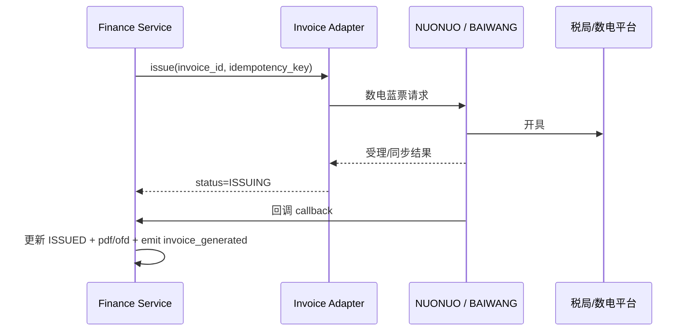

# Invoice Adapter — 对接规范（OpenAPI / DDL）

版本：1.0  
日期：2026-06-01  
关联 OpenAPI：`openapi-finance-v1.yaml` v1.5  
迁移：`V8__invoice_adapter_fields.sql`

---

## 1. Adapter 架构



| 平台编码 | 供应商 |
|---|---|
| `NUONUO` | 诺诺发票 |
| `BAIWANG` | 百望云 |
| `MANUAL` | 半自动人工回录 |

---

## 2. 发票状态机

| status | 说明 |
|---|---|
| `DRAFT` | 用户/系统创建申请，未提交厂商 |
| `PENDING_APPROVAL` | B/G 待财务审批（可选） |
| `ISSUING` | 已提交厂商，等待回调 |
| `ISSUED` | 开具成功 |
| `ISSUE_FAILED` | 失败，可重试 |
| `RED_FLUSHING` | 红冲中 |
| `RED_FLUSHED` | 已红冲（原蓝票） |
| `CANCELLED` | 取消申请 |

---

## 3. DDL 扩展

### 3.1 `invoices` 新增字段

| 字段 | 类型 | 说明 |
|---|---|---|
| provider | varchar(20) | NUONUO / BAIWANG / MANUAL |
| external_req_no | varchar(64) UNIQUE | 对厂商幂等流水号 |
| idempotency_key | varchar(100) UNIQUE | 平台幂等键 |
| invoice_type | varchar(10) | BLUE / RED |
| invoice_category | varchar(10) | SPECIAL / NORMAL（专/普） |
| red_flush_ref_id | uuid | 红票关联原蓝票 invoices.id |
| provider_invoice_no | varchar(40) | 数电发票号码 |
| tax_rate | numeric(5,4) | 如 0.1300 |
| amount_ex_tax | numeric(12,2) | 不含税金额 |
| tax_amount | numeric(12,2) | 税额 |
| ofd_url | text | OFD 下载 |
| xml_url | text | XML（可选） |
| remark | text | 备注（含识别码） |
| payment_reference_code | varchar(64) | 冗余账单回款码 |
| buyer_email | varchar(128) | |
| buyer_phone | varchar(20) | |
| issued_at | timestamptz | 开票时间 |
| issue_error_code | varchar(40) | |
| issue_error_message | varchar(500) | |
| invoice_batch_id | uuid | 合并批次 |
| retry_count | integer | 重试次数 |

### 3.2 新表 `invoice_line_item`

| 字段 | 类型 | 说明 |
|---|---|---|
| invoice_id | uuid FK | |
| line_no | integer | 行号 |
| item_name | varchar(200) | 商品名称 |
| tax_class_code | varchar(30) | 税收分类编码 |
| tax_rate | numeric(5,4) | |
| quantity | numeric(12,4) | |
| unit | varchar(20) | 如「次」「天」 |
| unit_price_ex_tax | numeric(12,6) | |
| amount_ex_tax | numeric(12,2) | |
| tax_amount | numeric(12,2) | |
| amount_inc_tax | numeric(12,2) | |
| order_id | uuid | 可选关联订单 |
| plate_number | varchar(20) | 车牌（租赁场景） |

### 3.3 新表 `invoice_provider_call_log`

| 字段 | 类型 | 说明 |
|---|---|---|
| invoice_id | uuid | |
| provider | varchar(20) | |
| operation | varchar(20) | ISSUE / QUERY / RED_FLUSH / CALLBACK |
| external_req_no | varchar(64) | |
| http_status | integer | |
| status | varchar(20) | SUCCESS / FAILED |
| request_payload | jsonb | 脱敏存储 |
| response_payload | jsonb | |
| latency_ms | integer | |

### 3.4 新表 `invoice_issue_batch`（合并开票）

| 字段 | 类型 | 说明 |
|---|---|---|
| batch_no | varchar(40) UNIQUE | |
| bill_id | uuid | B/G 月结账单 |
| billing_period | varchar(7) | |
| invoice_count | integer | 实际张数 |
| status | varchar(20) | PENDING / DONE / PARTIAL |

---

## 4. OpenAPI 新增接口（摘要）

| 方法 | 路径 | 说明 |
|---|---|---|
| GET | `/api/v1/invoices/{invoiceId}` | 发票详情（含明细行） |
| POST | `/api/v1/invoices/{invoiceId}/issue` | 提交 Adapter 开票 |
| POST | `/api/v1/invoices/{invoiceId}/red-flush` | 红冲 |
| POST | `/api/v1/invoices/{invoiceId}/manual-record` | 人工回录（MANUAL） |
| POST | `/api/v1/integrations/invoice/callback/nuonuo` | 诺诺回调 |
| POST | `/api/v1/integrations/invoice/callback/baiwang` | 百望回调 |
| POST | `/api/v1/bills/{billId}/invoices/issue-batch` | 按账单合并开票 |

---

## 5. 归一化开票请求（Adapter 内部）

```json
{
  "externalReqNo": "INV-20260601-00001",
  "invoiceCategory": "SPECIAL",
  "buyerName": "某某科技有限公司",
  "buyerTaxNo": "91330000XXXXXXXX",
  "buyerEmail": "finance@example.com",
  "remark": "账单BL202605001 识别码RF202605001 车牌浙A12345",
  "lines": [
    {
      "itemName": "*经营租赁*车辆租赁费",
      "taxClassCode": "3040502020000000000",
      "taxRate": 0.13,
      "quantity": 1,
      "unit": "次",
      "amountIncTax": 11300.00
    }
  ]
}
```

---

## 6. 回调处理（伪代码）

```pseudo
ON invoice_callback(provider, payload, signature):
  IF NOT verifySignature(provider, payload, signature):
    RETURN 403
  externalReqNo = payload.serialNo
  invoice = findByExternalReqNo(externalReqNo)
  IF invoice is null: RETURN 404
  IF alreadyProcessed(idempotency from payload):
    RETURN 200  // 幂等

  IF payload.success:
    UPDATE invoice SET
      status=ISSUED,
      provider_invoice_no=payload.invoiceNo,
      pdf_url=payload.pdfUrl,
      ofd_url=payload.ofdUrl,
      issued_at=now()
    EMIT invoice_generated
  ELSE:
    UPDATE invoice SET status=ISSUE_FAILED, issue_error_message=payload.msg
    IF retry_count < 3: scheduleRetry()
    ELSE: createFinanceTicket()
```

---

## 7. 关联文档

- [租车平台开票服务商RFP比价表（诺诺vs百望）.md](../../租车平台开票服务商RFP比价表（诺诺vs百望）.md)
- [租车平台订单开票方案对比（第三方vs自建）.md](../../租车平台订单开票方案对比（第三方vs自建）.md)
- [rental-event-contracts.md](../../05-事件契约/rental-event-contracts.md) § invoice_generated
