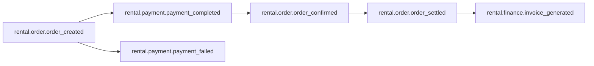

# 租车平台事件契约（Topic + Schema）

版本：1.0  
日期：2026-05-13

## 1. 通用事件头

所有事件必须包含以下字段：

- `event_id`：全局唯一事件ID（UUID）
- `event_type`：事件类型
- `occurred_at`：事件发生时间（ISO8601）
- `trace_id`：链路追踪ID
- `schema_version`：Schema版本（例如 `1.0`）
- `producer`：生产者服务名

```json
{
  "event_id": "d7c0505a-86ba-4e84-9d06-f3394f9fd2e0",
  "event_type": "payment_completed",
  "occurred_at": "2026-05-13T02:00:00Z",
  "trace_id": "trc_9f6beed3",
  "schema_version": "1.0",
  "producer": "payment-service"
}
```

---

## 2. Topic 列表

| Topic | Producer | Consumer | 说明 |
|---|---|---|---|
| `rental.order.order_created` | order-service | payment-service, operation-service | 订单创建后触发 |
| `rental.payment.payment_completed` | payment-service | order-service, finance-service | 支付成功 |
| `rental.payment.payment_failed` | payment-service | order-service | 支付失败 |
| `rental.order.order_confirmed` | order-service | store-service, finance-service | 订单已确认 |
| `rental.order.order_settled` | order-service | finance-service | 订单已结算 |
| `rental.finance.invoice_generated` | finance-service | order-service, customer-service | 发票已生成 |



---

## 3. 事件 Schema（核心）

## 3.1 order_created

**Topic**: `rental.order.order_created`

```json
{
  "header": {
    "event_id": "uuid",
    "event_type": "order_created",
    "occurred_at": "2026-05-13T02:00:00Z",
    "trace_id": "trc_xxx",
    "schema_version": "1.0",
    "producer": "order-service"
  },
  "data": {
    "order_id": "uuid",
    "order_no": "R202605130001",
    "user_id": "uuid",
    "vehicle_id": "uuid",
    "amount": 399.00,
    "currency": "CNY",
    "status": "PENDING_PAYMENT"
  }
}
```

## 3.2 payment_completed

**Topic**: `rental.payment.payment_completed`

```json
{
  "header": {
    "event_id": "uuid",
    "event_type": "payment_completed",
    "occurred_at": "2026-05-13T02:01:00Z",
    "trace_id": "trc_xxx",
    "schema_version": "1.0",
    "producer": "payment-service"
  },
  "data": {
    "order_id": "uuid",
    "payment_id": "uuid",
    "channel": "wechat",
    "channel_txn_no": "wx_20260513_001",
    "amount": 399.00,
    "status": "SUCCESS",
    "idempotency_key": "wx_20260513_001"
  }
}
```

## 3.3 payment_failed

**Topic**: `rental.payment.payment_failed`

```json
{
  "header": {
    "event_id": "uuid",
    "event_type": "payment_failed",
    "occurred_at": "2026-05-13T02:01:00Z",
    "trace_id": "trc_xxx",
    "schema_version": "1.0",
    "producer": "payment-service"
  },
  "data": {
    "order_id": "uuid",
    "payment_id": "uuid",
    "channel": "alipay",
    "fail_code": "PAY_TIMEOUT",
    "fail_message": "payment timeout"
  }
}
```

## 3.4 order_confirmed

**Topic**: `rental.order.order_confirmed`

```json
{
  "header": {
    "event_id": "uuid",
    "event_type": "order_confirmed",
    "occurred_at": "2026-05-13T02:02:00Z",
    "trace_id": "trc_xxx",
    "schema_version": "1.0",
    "producer": "order-service"
  },
  "data": {
    "order_id": "uuid",
    "order_no": "R202605130001",
    "status": "CONFIRMED",
    "confirmed_at": "2026-05-13T02:02:00Z"
  }
}
```

## 3.5 order_settled

**Topic**: `rental.order.order_settled`

```json
{
  "header": {
    "event_id": "uuid",
    "event_type": "order_settled",
    "occurred_at": "2026-05-13T08:30:00Z",
    "trace_id": "trc_xxx",
    "schema_version": "1.0",
    "producer": "order-service"
  },
  "data": {
    "order_id": "uuid",
    "total_fee": 458.50,
    "paid_amount": 399.00,
    "balance_amount": 59.50,
    "status": "SETTLED"
  }
}
```

## 3.6 invoice_generated

**Topic**: `rental.finance.invoice_generated`

```json
{
  "header": {
    "event_id": "uuid",
    "event_type": "invoice_generated",
    "occurred_at": "2026-05-13T09:00:00Z",
    "trace_id": "trc_xxx",
    "schema_version": "1.0",
    "producer": "finance-service"
  },
  "data": {
    "order_id": "uuid",
    "invoice_id": "uuid",
    "invoice_no": "INV20260513001",
    "amount": 458.50,
    "pdf_url": "https://cdn.example.com/invoice/INV20260513001.pdf"
  }
}
```

---

## 4. 幂等与重试规范

- 生产端：基于 Outbox 保证“写库与发事件”同事务。
- 消费端：基于 `consumer_group + event_id` 去重。
- 重试：指数退避（1s/5s/30s/2m），超限进入 DLQ。
- 回放：支持按 `event_id`、时间区间、`trace_id` 回放审计。

---

## 5. 版本演进策略

- 向后兼容原则：仅新增字段，不删除/重命名既有字段。
- 重大变更：升级 `schema_version`，双写过渡至少一个发布周期。
- 废弃策略：在契约文档标记 `deprecated=true` 并公告下线窗口。
