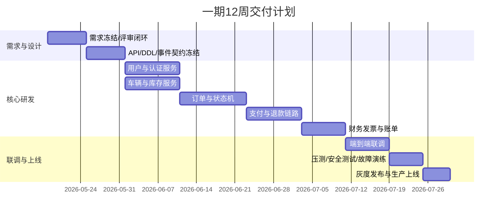

# 租车平台一期迭代排期与人力风险计划

版本：v1.0  
日期：2026-05-13

## 1. 一期目标

- 在 12 周内完成 MVP 上线：用户、车辆、订单、支付、提还车履约、账单与电子发票、基础客服。
- 达成核心验收：端到端主流程可用，支付与订单一致性可追踪，无车辆超卖。

## 2. 团队配置建议（18人）

| 角色 | 人数 | 主要职责 |
|---|---:|---|
| 后端开发 | 8 | 微服务、事件链路、数据库 |
| 前端开发 | 4 | C端与后台管理端 |
| QA | 3 | 功能、集成、回归、性能 |
| DevOps/SRE | 2 | CI/CD、部署、监控、告警 |
| 产品经理 | 1 | 需求管理、验收推进 |

## 3. 12周排期

## 4. 周粒度里程碑

| 周次 | 交付物 | 验收要点 |
|---|---|---|
| W1 | 需求与范围冻结 | FR/BR/AC 无歧义 |
| W2 | OpenAPI/DDL/事件契约冻结 | 设计评审通过 |
| W3-W4 | 用户/车辆模块开发完成 | 单元测试通过 |
| W5-W6 | 订单模块开发完成 | 状态机校验通过 |
| W7-W8 | 支付退款与幂等完成 | 重复回调不重复记账 |
| W9 | 财务发票完成 | 账单开票闭环 |
| W10 | 全链路联调 | 主流程打通 |
| W11 | 压测与安全测试 | NFR 达标 |
| W12 | 灰度与上线 | 生产稳定运行 |

## 5. 人力投入节奏

| 阶段 | 后端 | 前端 | QA | SRE | PM |
|---|---:|---:|---:|---:|---:|
| W1-W2 设计冻结 | 4 | 2 | 1 | 1 | 1 |
| W3-W8 核心开发 | 8 | 4 | 2 | 1 | 1 |
| W9-W10 联调回归 | 6 | 3 | 3 | 2 | 1 |
| W11-W12 上线保障 | 4 | 2 | 3 | 2 | 1 |

## 6. 风险清单与应对

| 风险ID | 风险描述 | 概率 | 影响 | 应对策略 |
|---|---|---|---|---|
| R1 | 支付回调幂等设计缺陷导致重复入账 | 中 | 高 | 统一幂等键、dedup表、回放演练 |
| R2 | 订单与库存并发冲突导致超卖 | 中 | 高 | 时间窗占用表+乐观锁+冲突重试 |
| R3 | 第三方支付联调延期 | 高 | 中 | 提前沙箱联调，预留Mock降级方案 |
| R4 | 发票能力依赖外部平台稳定性 | 中 | 中 | 增加异步重试与人工兜底流程 |
| R5 | 压测发现瓶颈影响上线 | 中 | 高 | W10前置压测，预留2周性能窗口 |
| R6 | 需求变更导致排期滑动 | 中 | 高 | 变更评审机制，冻结窗口管理 |

## 7. 上线前必过门禁

- P0 功能用例通过率 100%
- 核心链路自动化回归通过率 >= 95%
- 压测达到：下单 1000 单/分钟，核心接口 P95 < 200ms
- 审计日志、告警、回滚预案演练通过
