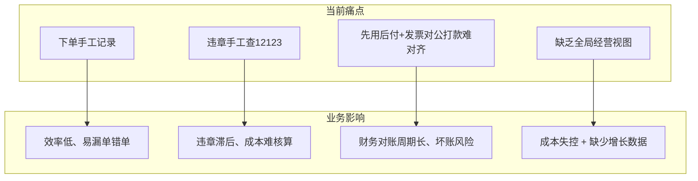
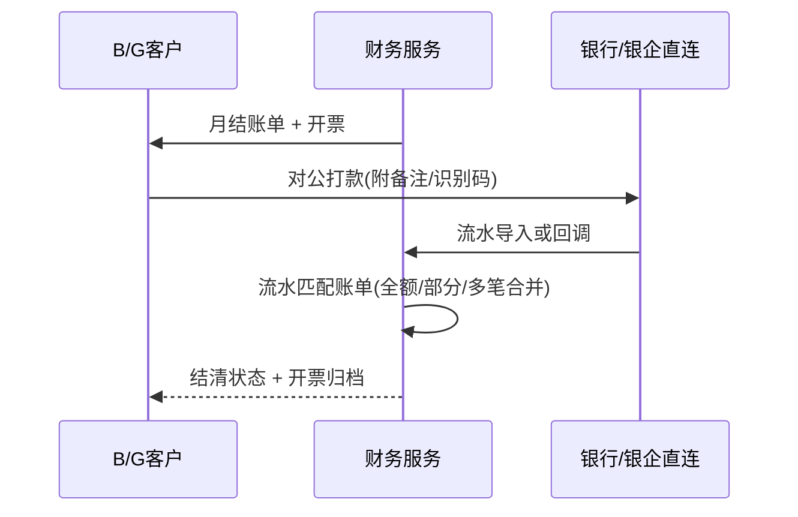

# 租车平台业务背景与客户痛点说明

版本：1.0  
日期：2026-06-01  
关联文档：[租车平台需求规格说明书.md](./租车平台需求规格说明书.md)、[租车平台需求补充说明书（事故处理+用户认证细化）.md](./租车平台需求补充说明书（事故处理+用户认证细化）.md)

---

## 1. 客户概况

| 维度 | 现状描述 |
|---|---|
| 业务模式 | 传统租车服务为主，**尚未形成端到端数字化运营** |
| 资产规模 | **重资产运营**，车队规模约 **200 辆** |
| 客户结构 | 以 **B 端企业 / G 端政务** 为主，结算习惯为 **先用车、后结算（账期/月结）** |
| 开票与回款 | 客户依据 **发票** 对公打款，线下流程多，**订单、账单、银行流水难以一一勾稽** |

本项目建设目标：用统一平台承接「下单—履约—结算—对账—开票—回款」全链路，支撑约 200 台车的精细化运营与成本可控。

---

## 2. 客户痛点总览

---

## 3. 痛点分项说明与平台应对

### 3.1 用户下单仍依赖手工记录（P-ORDER）

**现状**

- 电话、微信、表格等方式接单，订单分散在多人手中。
- 车辆占用、改期、取消缺乏统一状态机，易出现 **超卖、漏记、重复计费**。

**影响**

- 门店与调度无法实时看到可用库存。
- 财务侧难以按订单自动生成账单与开票依据。

**平台应对（需求映射）**

| 能力 | 需求/模块引用 |
|---|---|
| 线上下单与订单全生命周期 | FR-ORD-001 ~ FR-ORD-005 |
| 车辆时间窗占用与防超卖 | BR-002、FR-VEH-001/002 |
| B/G 先用车后付 | FR-ORD-006、FR-PAY-005、BR-008 ~ BR-013 |
| 管理后台订单检索与导出 | FR-OPS（订单管理看板，见 §3.5） |

---

### 3.2 违章查询依赖手工登录 12123（P-VIOLATION）

**现状**

- 运营人员逐车在 **交管 12123** 或线下渠道查询违章，耗时长、易漏查。
- 违章费用与订单、客户主体难以自动关联。

**影响**

- 违章处理滞后，增加车辆停运与合规风险。
- 第三方查询若接入，缺乏 **配额与成本台账**，费用不可控。

**平台应对（需求映射）**

| 能力 | 需求/模块引用 |
|---|---|
| 批量违章查询（异步任务） | FR-EXT-001、AC-012 |
| 月度配额与超额策略 | FR-EXT-002、BR-023 |
| 单车单次成本统计 | FR-EXT-003、BR-024 |
| 详细说明 | [租车平台需求补充说明书（违章+GPS+地图）.md](./租车平台需求补充说明书（违章+GPS+地图）.md) |

> 说明：平台对接 **数脉科技违章 API**（[产品页](https://www.shumaiapi.com/productDetail/25)，约 **¥0.06/次**，套餐 600 元/1 万次），**不替代** 12123 官方账号体系；目标是减少人工逐车登录频次，结果需可审计、可导出。

---

### 3.3 先使用后结算 + 发票对公打款，订单与银行收款难对齐（P-FINANCE）

**现状**

- B/G 客户普遍 **用车在前、付款在后**，账期多为月结或合同约定周期。
- 开票流程 **按客户发票习惯定制**（抬头、税号、开票内容、合并/拆分规则各异）。
- 客户凭发票对公转账，银行流水 **无订单号、无账单号**，财务需人工匹配。

**影响**

- 应收账款账龄不清晰，部分支付、多笔合并打款难以处理。
- 对账周期长，影响授信评估与续租决策。

**平台应对（需求映射）**

| 能力 | 需求/模块引用 |
|---|---|
| 账期账单生成与确认 | FR-FIN-005、BR-018 |
| 对公支付回调、部分支付 | FR-PAY-006、BR-019、BR-020 |
| 支付失败自动重试与死信工单 | FR-PAY-007、BR-021 ~ BR-022 |
| 账单确认后编排（核销、开票就绪） | FR-FIN-006 |
| **银行流水与账单/订单勾稽**（补充） | FR-FIN-007 ~ FR-FIN-009，见需求补充说明书 |
| **数电开票** | 推荐第三方 SaaS（诺诺/百望），见 [开票方案对比](./租车平台订单开票方案对比（第三方vs自建）.md) |
| **数电开票方案** | [订单开票方案对比（第三方vs自建）](./租车平台订单开票方案对比（第三方vs自建）.md) |

**目标态（对账闭环）**

---

### 3.4 无法精细化运营，成本与增长数据缺失（P-OPS）

**现状**

- 管理层无法 **一站式查看**：营收（月/季/年）、成本结构、人员、司机、车辆、订单、财务指标。
- 车辆利用率、单车毛利、司机排班效率等 **缺少统一口径**。

**影响（客户自述两大问题）**

1. **无法进行有效的成本控制** — 维修、保险、违章、人力、油耗等分散记账，难与订单收入联动。
2. **缺乏用于业务增长的数据** — 无法按客户类型、线路、车型分析复购与贡献度，决策依赖经验。

**平台应对（需求映射）**

| 经营域 | 一期目标能力 | 需求引用 |
|---|---|---|
| 营收分析 | 按月/季/年汇总租金、司机服务费、违约金 | FR-OPS-004 ~ FR-OPS-006 |
| 成本分析 | 车辆维养、违章查询、第三方接口、事故赔付等台账汇总 | FR-OPS-007、FR-EXT-003 |
| 车辆管理 | 状态、GPS、违章、维保到期 | FR-VEH、FR-EXT |
| 司机管理 | 包车带司机排班、在岗状态、服务评价 | FR-ORD-007、FR-OPS-008 |
| 订单管理 | 全状态筛选、导出、异常单预警 | FR-ORD、FR-OPS-009 |
| 人员/组织 | B/G 组织、成员、权限、审批审计 | FR-USER-006 ~ FR-USER-010 |
| 财务管理 | 账单、对公回款、发票、银行勾稽 | FR-FIN、FR-PAY |

二期可扩展：客户贡献度分析、预测性调度、智能定价（见 SRS §8 版本规划）。

---

## 4. 痛点 — 能力 — 文档对照矩阵

| 痛点编号 | 痛点摘要 | 优先级 | 主要交付文档 | 一期/二期 |
|---|---|---|---|---|
| P-ORDER | 手工下单 | P0 | SRS §3.3 | 一期 |
| P-VIOLATION | 手工查违章 | P0 | 需求补充（违章+GPS+地图） | 一期 |
| P-FINANCE | 发票对公打款难对齐 | P0 | SRS §3.4/3.5 + 需求补充（事故+认证）§5 | 一期核心 / 二期增强勾稽 |
| P-OPS | 缺乏精细化运营视图 | P1 | SRS §3.7 增强 | 一期基础看板 / 二期深化 |
| P-ACCIDENT | 使用中事故处理不规范 | P0 | 需求补充（事故+认证）§3 | 一期 |
| P-AUTH | 用户认证场景复杂 | P0 | 需求补充（事故+认证）§4 | 一期 |

---

## 5. 本期需求补充（相对 v1.8 基线）

在既有 SRS v1.8 基础上，客户进一步提出：

| 补充项 | 说明 | 详细文档 |
|---|---|---|
| **使用中事故问题** | 租期内事故上报、定责、停运、费用与保险协同 | [租车平台需求补充说明书（事故处理+用户认证细化）.md](./租车平台需求补充说明书（事故处理+用户认证细化）.md) §3 |
| **用户认证需求细化** | C/B/G 分场景认证、代订车、资质与授信、开票抬头 | 同上 §4 |

上述内容已回写至 [租车平台需求规格说明书.md](./租车平台需求规格说明书.md) v1.9（功能条目、业务规则、验收标准）。

---

## 6. 成功度量建议（与客户对齐）

| 指标 | 基线（现状） | 目标（上线后 6 个月） |
|---|---|---|
| 订单线上化率 | 低（以手工为主） | ≥ 90% 新单经系统创建 |
| 违章人工查询耗时 | 高（逐车 12123） | 批量任务化，人工耗时下降 ≥ 60% |
| 月结对账周期 | 长（人工匹配银行流水） | T+3 日内完成自动+人工复核勾稽 |
| 经营看板覆盖 | 无统一看板 | 月/季/年营收与核心成本可一键导出 |
| 租期事故闭环率 | 流程分散 | 100% 事故单关联订单并可追溯至结算 |

---

## 7. 变更记录

| 版本 | 日期 | 变更内容 |
|---|---|---|
| v1.0 | 2026-06-01 | 初版：整理客户痛点、平台应对与需求补充索引 |
