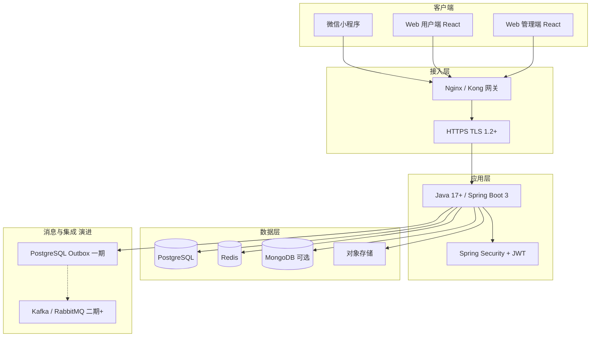

# 租车平台技术栈选型说明

版本：v1.1  
日期：2026-06-01  
适用对象：架构评审、研发立项、客户技术尽调、运维交接

> 与 [租车平台架构与详细设计说明书.md](./租车平台架构与详细设计说明书.md)（SDD）配套：SDD 描述**目标架构**；本文档明确**一期落地选型**与**演进路径**。  
> **后端正式选型：Java + Spring Boot 3**（交付包内 Node 工程仅作接口联调原型，见 §3.1.1）。

---

## 1. 选型原则

| 原则 | 说明 |
|---|---|
| 团队可交付 | 后端以 **Java 17+ / Spring Boot 3** 为主栈，便于企业级扩展、招聘与外包交接 |
| 业务匹配 | 交易型数据走 PostgreSQL；缓存与会话走 Redis；非结构化日志/附件元数据可走 MongoDB |
| 渐进演进 | 一期 Spring Boot 模块化单体；流量与团队成熟后按域拆为微服务 |
| 开放对接 | 对外 REST + OpenAPI 3.1；第三方（违章、GPS、地图、开票、支付）统一 Adapter |
| 可观测默认可用 | Micrometer + Prometheus、结构化日志、链路追踪从一期纳入 |

---

## 2. 总体分层一览



---

## 3. 分域选型明细

### 3.1 后端与 API（正式选型）

| 类别 | 选型 | 版本建议 | 选型理由 | 备选（未采用原因） |
|---|---|---|---|---|
| 语言 | **Java** | **17 LTS** 或 **21 LTS** | 企业租赁/财务场景成熟度高、类型安全、线程池与事务模型清晰 | Node.js：交付包原型用，非生产主栈 |
| 基础框架 | **Spring Boot** | **3.3.x** | 约定优于配置、生态完整、与 Spring Cloud 演进衔接 | Quarkus：团队栈与中间件习惯以 Spring 为主 |
| Web | **Spring Web MVC** | 随 Boot 3 | REST、过滤器、全局异常、与 OpenAPI 工具链成熟 | WebFlux：一期以同步 JDBC 为主，二期高并发接口可局部引入 |
| 安全 | **Spring Security** + **JWT** | RS256 建议 | RBAC、方法级权限、OAuth2 Resource Server 可扩展 | 自研鉴权：审计与合规成本高 |
| 参数校验 | **Bean Validation**（Hibernate Validator） | Jakarta Validation 3.x | 注解驱动、与 Spring 无缝 | — |
| 持久化 | **MyBatis-Plus** 或 **Spring Data JPA** | 二选一 | 复杂报表/SQL 选 MyBatis-Plus；标准 CRUD 选 JPA | 纯 JDBC：可维护性不足 |
| 连接池 | **HikariCP** | 随 Boot 默认 | 性能与稳定性 | — |
| 缓存 | **Spring Data Redis** + **Redisson**（可选） | Redis 7+ | 会话、分布式锁、幂等、GPS 位置缓存 | — |
| API 文档 | **springdoc-openapi** | 2.x | 由代码/注解生成 OpenAPI 3.1，对齐 `docs/03-API/OpenAPI` | 手写 YAML 与代码双维护 |
| 定时任务 | **Spring Scheduling** / **XXL-JOB**（可选） | — | 违章批量、对公支付重试、Outbox 投递 | — |
| 构建 | **Maven** 或 **Gradle** | — | 多模块：`rental-api`、`rental-domain`、`rental-infra` | — |
| 测试 | **JUnit 5** + **Mockito** + **Testcontainers** | — | 集成测试连真实 PG/Redis 容器 | — |

**推荐模块划分（一期单体）**：

```
rental-platform-java/
├── rental-bootstrap/          # 启动、配置、Actuator
├── rental-modules/
│   ├── rental-user/
│   ├── rental-vehicle/
│   ├── rental-order/
│   ├── rental-payment/
│   └── rental-finance/
├── rental-common/             # 统一响应、异常、JWT、审计
└── rental-integration/        # 违章/GPS/开票/支付 Adapter
```

**与 OpenAPI 关系**：以 `docs/03-API/OpenAPI/*.yaml` 为**契约基线**；Spring 实现通过 springdoc 导出 YAML，联调前与契约 diff。

#### 3.1.1 交付包内 Node 原型说明

| 项 | 说明 |
|---|---|
| 路径 | `rental-platform/services/api`（Express 5 + TypeScript） |
| 用途 | **接口联调演示、前端 Mock、Postman 冒烟**；不作为生产实施基线 |
| 生产 | 按本文件 **Java Spring** 栈新建工程，复用同目录下 DDL、OpenAPI、网关配置 |

### 3.2 前端

| 端 | 选型 | 版本建议 | 说明 |
|---|---|---|---|
| 管理后台 | **React** + **Vite** + **TypeScript** | React 19、Vite 5 | `rental-platform/apps/web-admin` |
| 用户 Web/H5 | **React** + **Vite** + **TypeScript** | 同上 | `rental-platform/apps/web-user` |
| 样式 | **Tailwind CSS** | 3.4.x | 与组件库（CVA + clsx）组合 |
| 路由 | **React Router** | 7.x | 管理端与用户端分应用部署 |
| 小程序 | **微信原生小程序** | 基础库按微信要求 | `rental-platform/apps/mp-user`；地图/GPS/支付走微信 API + **Spring 后端** 聚合 |

> 前后端分离：前端仅通过 HTTPS 调用 Spring REST；Token 存小程序 storage / Web localStorage（配合刷新令牌策略）。

### 3.3 数据存储

| 用途 | 选型 | 说明 |
|---|---|---|
| 核心业务库 | **PostgreSQL** | 用户、车辆、订单、支付、账单、发票、违章任务、GPS 绑定等；按域分 schema/分库 |
| 缓存 / 会话 / 分布式锁 | **Redis** | Spring Data Redis；登录态、验证码、GPS 缓存（TTL 30s）、幂等键 |
| 文档与非结构化 | **MongoDB**（二期） | Spring Data MongoDB；审计明细、回调原文；一期可用 PG **JSONB** |
| 轨迹与时序 | **PostgreSQL + PostGIS** 或 **TimescaleDB** | GPS 轨迹、地理围栏 |
| 检索与分析 | **Elasticsearch**（可选） | 运营检索；一期 PG + 结构化日志 |
| 文件 | **对象存储**（OSS/COS/MinIO） | Spring 集成 SDK 上传证件、验车照、发票 PDF |

**Schema 迁移**：**Flyway**（与 Spring Boot 原生集成推荐）或 **Liquibase**；脚本见 `docs/04-数据库/Migrations/`。

### 3.4 消息与一致性

| 阶段 | 方案 |
|---|---|
| **一期 MVP** | **PostgreSQL Outbox** + Spring `@Scheduled` 或 XXL-JOB 投递 |
| **二期增长** | **Spring for Apache Kafka** 或 **Spring AMQP**（RabbitMQ）；Topic 见 [rental-event-contracts.md](./05-事件契约/rental-event-contracts.md) |

### 3.5 网关与接入

| 组件 | 选型 | 说明 |
|---|---|---|
| 反向代理 / 负载均衡 | **Nginx** | 生产入口、静态资源、TLS 终结 |
| API 网关（可选） | **Kong** 或 **Spring Cloud Gateway** | 统一鉴权、限流、路由 |
| 协议 | **HTTPS** | TLS 1.2+（目标 1.3） |

### 3.6 第三方集成（Adapter 层）

| 能力 | 实现方式 | 规范文档 |
|---|---|---|
| 违章查询 | Spring `RestClient` / WebClient Adapter | [integration-shumai-violation-v1.md](./03-API/规范/integration-shumai-violation-v1.md) |
| GPS | Adapter 抽象 + 图强/承载实现 | [integration-gps-providers-v1.md](./03-API/规范/integration-gps-providers-v1.md) |
| 地图 | 小程序 SDK + 服务端 Key | 需求补充说明书（违章+GPS+地图） |
| 数电开票 | Invoice Adapter 模块 | [integration-invoice-adapter-v1.md](./03-API/规范/integration-invoice-adapter-v1.md) |
| 支付 | 微信/支付宝 SDK + 回调验签 | SDD 支付幂等章节 |

### 3.7 可观测与运维

| 类别 | 选型 | 说明 |
|---|---|---|
| 指标 | **Micrometer** + **Prometheus** + **Grafana** | Spring Boot Actuator 暴露 `/actuator/prometheus` |
| 日志 | **Logback** JSON → ELK / 云日志 | `trace_id`、`request_id` MDC |
| 链路追踪 | **Micrometer Tracing** + **OpenTelemetry** → Jaeger | 与 Spring Cloud 兼容 |
| 健康检查 | **Spring Boot Actuator** | `health`、`readiness`、`liveness` 供 K8s 探针 |

### 3.8 工程化与部署

| 类别 | 选型 | 说明 |
|---|---|---|
| 版本管理 | **Git** | 主干 + 功能分支 |
| 容器 | **Docker** | `eclipse-temurin:17-jre` 基础镜像；多阶段构建 fat jar |
| 编排（生产） | **Kubernetes**（推荐） | Deployment + HPA；配置 ConfigMap/Secret |
| CI/CD | GitHub Actions / GitLab CI | `mvn test` → 镜像 → 部署 |
| 配置 | `application-{profile}.yml` + 环境变量 | 密钥不入库；生产用云密钥服务 |

---

## 4. 一期 vs 目标架构对照

| 维度 | 一期（落地） | 目标（SDD 全量） |
|---|---|---|
| 服务形态 | **Spring Boot 模块化单体** | Spring Cloud 微服务（User/Vehicle/Order/Payment/Finance…） |
| 消息 | Outbox + 定时投递 | Kafka/RabbitMQ 全量事件驱动 |
| 前端 | React 管理端 + 用户 Web + 微信小程序 | 可增加独立 App |
| 数据库 | PostgreSQL + Redis 必选 | + MongoDB、ES、PostGIS 按量引入 |
| 网关 | Nginx 为主 | Nginx + Kong / Spring Cloud Gateway |
| 部署 | Docker + 少量云主机 / K8s | K8s 灰度 + 多 AZ |

---

## 5. 与非功能需求（NFR）的对应

| NFR 编号 | 要求摘要 | 技术栈支撑 |
|---|---|---|
| NFR-PERF-001 | API P95 < 200ms | HikariCP、Redis、PG 索引、网关限流 |
| NFR-PERF-002 | 首屏 < 3s | Vite 构建、CDN、按需路由 |
| NFR-PERF-003 | >= 1000 单/分钟 | Spring 多实例水平扩展、PG 读写分离、Outbox 异步 |
| NFR-REL-001~003 | 99.9% / RTO / RPO | PG 主从、Redis 哨兵、K8s 多副本 |
| NFR-SEC-001~004 | HTTPS、RBAC、MFA、等保 | Spring Security、JWT RS256、审计 AOP、网关 WAF |
| NFR-MNT-001~003 | 测试覆盖率、可观测、CI/CD | JUnit5、Actuator、Micrometer、CI 流水线 |

---

## 6. 版本与实施检查清单

- [ ] JDK **17+**（推荐 Temurin 17 或 21）与 Maven/Gradle 版本团队统一
- [ ] Spring Boot **3.3.x**、Spring Security 6.x 与依赖 BOM 对齐
- [ ] PostgreSQL **15+**、Redis **7+** 生产版本确认
- [ ] JWT 使用 **RS256** + 密钥轮换；Refresh Token 存 Redis
- [ ] Flyway/Liquibase 选定其一；与 `docs/04-数据库/Migrations` 脚本对齐
- [ ] springdoc 导出 OpenAPI 与 `docs/03-API/OpenAPI` 契约 diff 通过
- [ ] React 19 前端与 Spring API 跨域、CORS、统一错误码（见 api-error-codes-v1）
- [ ] 第三方密钥仅通过环境变量/密钥管理服务注入
- [ ] Node 原型 `services/api` 标注为演示环境，生产镜像仅构建 Java 服务

---

## 7. 相关文档

| 文档 | 关系 |
|---|---|
| [租车平台架构与详细设计说明书.md](./租车平台架构与详细设计说明书.md) | 逻辑架构、服务边界、部署与安全 |
| [租车平台需求规格说明书.md](./租车平台需求规格说明书.md) | NFR 基线 |
| [00-文档索引概览.md](./00-文档索引概览.md) | 文档导航 |
| [rental-platform/services/api/package.json](../rental-platform/services/api/package.json) | Node **联调原型**依赖（非生产主栈） |
| [rental-platform/apps/web-admin/package.json](../rental-platform/apps/web-admin/package.json) | 管理端依赖实况 |
