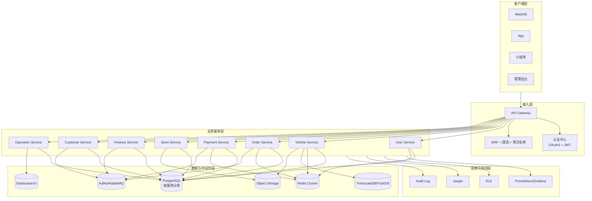
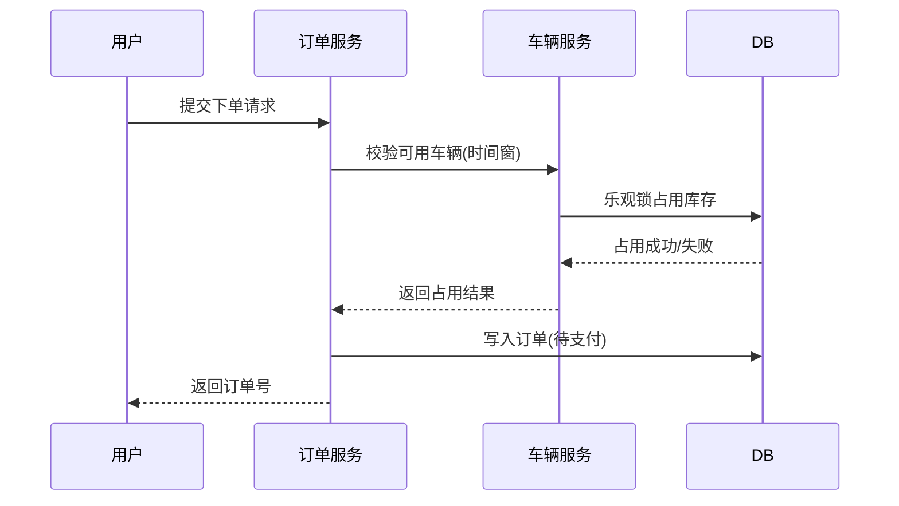
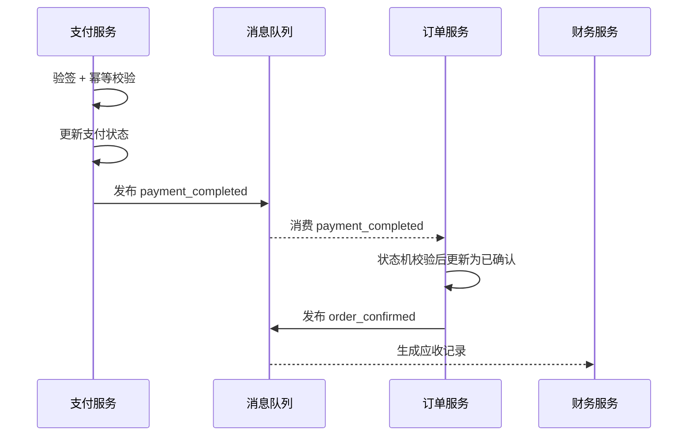
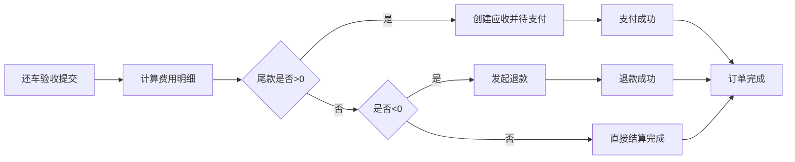
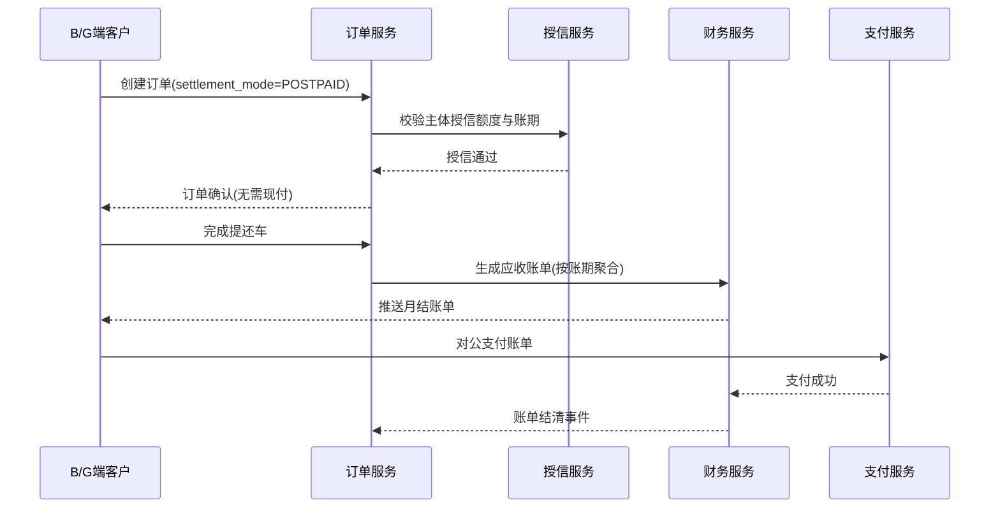
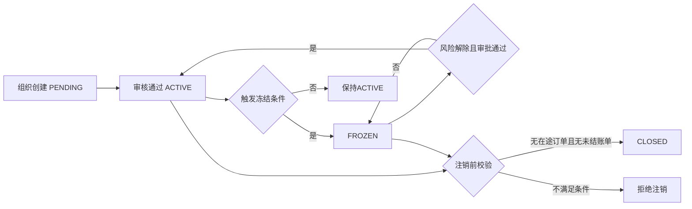
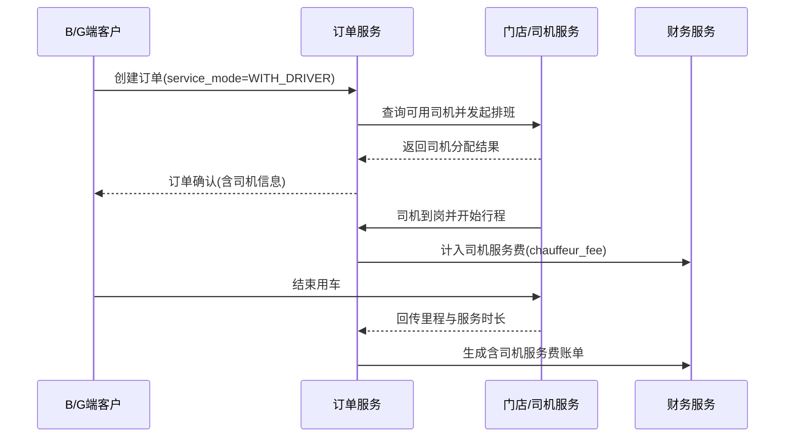
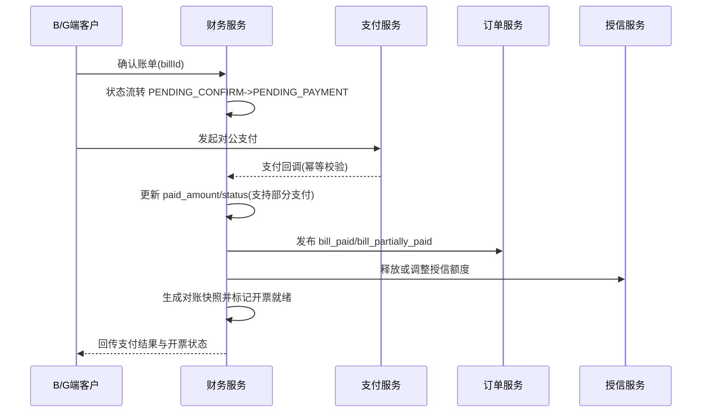
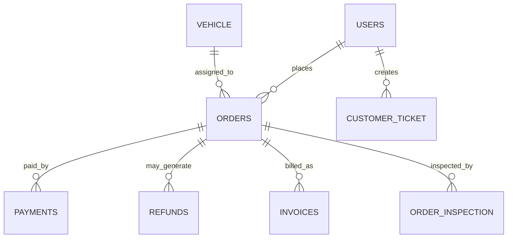
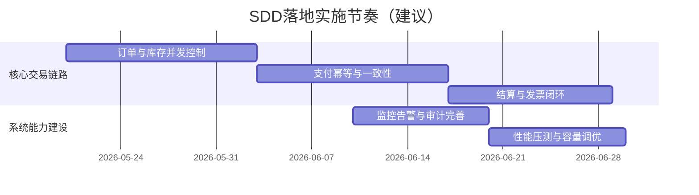

# 租车平台架构与详细设计说明书（SDD）

版本：1.6  
日期：2026-05-14

## 1. 设计目标

本文档定义租车平台的系统架构、模块边界、接口规范、数据设计、关键流程、部署安全与可观测方案，用于指导研发实施与测试验收。

## 1.1 设计原则

- 领域解耦：按业务域拆分微服务，单一职责。
- 一致性优先：交易链路采用“本地事务 + 事件最终一致性”。
- 可扩展：服务可独立扩容，存储按域分库。
- 可观测：日志、指标、链路追踪全覆盖。
- 安全合规：认证授权、数据保护、审计闭环。
- 多结算模式：支持 C 端即时支付与 B/G 端先用后付并行。

---

## 2. 逻辑架构设计



---

## 3. 模块与服务详细设计

## 3.1 User Service

**职责**
- 用户账号、实名认证、驾照管理、黑名单管理。
- B/G 端组织主体管理、成员管理、角色权限管理、审批任务管理。

**核心接口**
- `POST /api/v1/users/register`
- `POST /api/v1/users/login`
- `GET /api/v1/users/{id}`
- `POST /api/v1/users/{id}/license`
- `POST /api/v1/orgs`
- `GET /api/v1/orgs/{orgId}`
- `POST /api/v1/orgs/{orgId}/members`
- `PUT /api/v1/orgs/{orgId}/members/{memberId}/roles`
- `POST /api/v1/orgs/{orgId}/approvals`
- `PUT /api/v1/orgs/{orgId}/approvals/{approvalId}`

**核心表**
- `users`、`user_identity`、`user_license`、`user_blacklist`
- `org_account`、`org_member`、`org_member_role`、`org_approval_task`

**发布事件**
- `user_created`、`user_verified`、`license_expired`
- `org_member_added`、`org_role_changed`、`org_approval_completed`

## 3.2 Vehicle Service

**职责**
- 车辆档案、库存可用性、状态流转、轨迹管理。

**核心接口**
- `GET /api/v1/vehicles`
- `GET /api/v1/vehicles/{id}`
- `PUT /api/v1/vehicles/{id}/status`
- `POST /api/v1/vehicles/{id}/location`

**核心表**
- `vehicle`、`vehicle_type`、`vehicle_availability`、`gps_track`

**发布事件**
- `vehicle_reserved`、`vehicle_rented`、`vehicle_returned`

## 3.3 Order Service

**职责**
- 订单生命周期、费用试算、状态机控制、结算协调、结算模式管理（即时支付/先用后付）。
- 服务方式管理（纯租车/包车带司机）与司机调度协同。

**核心接口**
- `POST /api/v1/orders`
- `GET /api/v1/orders/{id}`
- `PUT /api/v1/orders/{id}/cancel`
- `PUT /api/v1/orders/{id}/pickup`
- `PUT /api/v1/orders/{id}/return`

**核心表**
- `orders`、`order_fee_detail`、`order_inspection`、`order_outbox`

**发布事件**
- `order_created`、`order_confirmed`、`order_settled`、`order_completed`

## 3.4 Payment Service

**职责**
- 支付单管理、支付回调幂等、退款处理、渠道适配、账期账单支付处理。

**核心接口**
- `POST /api/v1/payments`
- `POST /api/v1/payments/{id}/confirm`
- `POST /api/v1/refunds`
- `GET /api/v1/payments/{id}`

**核心表**
- `payments`、`payment_channel_record`、`refunds`

**发布事件**
- `payment_completed`、`payment_failed`、`refund_completed`

## 3.5 Finance / Store / Customer / Operation

- `Finance Service`：账单、发票、对账、报表、B/G 端账期结算与逾期跟踪。
- `Store Service`：门店、库存、员工作业。
- `Customer Service`：工单、投诉、仲裁、赔付。
- `Operation Service`：价格规则、活动管理、运营报表。
- `Finance Service` 关键接口：`POST /api/v1/bills`、`PUT /api/v1/bills/{billId}/confirm`、`GET /api/v1/bills/{billId}`。
- `Payment Service` 关键接口：`POST /api/v1/payments/bills`、`POST /api/v1/payments/bills/callback`。

---

## 4. 关键流程详细设计

## 4.1 下单与库存占用



**关键设计点**
- 车辆占用通过 `vehicle_availability` 实现时间窗冲突检测。
- 订单创建与 Outbox 写入同事务提交。

## 4.2 支付确认一致性



**关键设计点**
- 幂等键：`channel_txn_no`。
- 消费去重：`consumer_dedup(event_id, consumer_group)`。

## 4.3 还车结算



## 4.4 B/G端先用后付流程



## 4.5 B/G组织生命周期与审批职责分离



**关键设计点**
- 订单确认规则按 `settlement_mode` 分流：`PREPAID` 需支付成功，`POSTPAID` 需授信通过。
- 审批任务强制职责分离：`applicant_user_id != approver_user_id`。
- 组织冻结/注销由 User + Finance + Order 联合校验（订单在途、账单未结清、审批状态）。

## 4.6 B/G端包车带司机流程



**关键设计点**
- 订单新增 `service_mode` 字段：`SELF_DRIVE` / `WITH_DRIVER`。
- `WITH_DRIVER` 需完成司机排班后才允许进入履约阶段。
- 财务结算拆分基础租车费与司机服务费，均纳入账单与审计。

## 4.7 账单确认与对公支付后流程



**关键设计点**
- `PENDING_CONFIRM` 账单必须先确认后支付，避免未确认账单被误付。
- 对公支付回调通过 `channel_txn_no` + `idempotency_key` 做幂等去重。
- 支持部分支付：账单状态可在 `PARTIALLY_PAID` 与 `PENDING_PAYMENT` 之间迭代。
- 账单 `PAID` 后统一触发：订单结清、授信释放、对账快照归档、开票就绪通知。
- 支付失败自动重试策略：最多3次，间隔 `5m -> 15m -> 30m`，超限转死信队列并自动生成财务工单。

---

## 5. 数据库详细设计

## 5.1 分库策略

| 数据库 | 服务域 | 说明 |
|---|---|---|
| `rental_user` | User | 用户与认证 |
| `rental_vehicle` | Vehicle | 车辆与轨迹 |
| `rental_order` | Order | 订单与结算 |
| `rental_payment` | Payment | 支付与退款 |
| `rental_finance` | Finance | 账单发票 |
| `rental_store` | Store | 门店与员工 |
| `rental_customer` | Customer | 工单投诉 |
| `rental_operation` | Operation | 运营活动 |

## 5.2 核心表增强规范

所有核心交易表必须包含：
- 审计字段：`created_at`、`updated_at`、`created_by`、`updated_by`
- 并发控制：`version`
- 软删除：`is_deleted`
- 幂等追踪：`idempotency_key`（按场景）
- 结算模式：`settlement_mode`（`PREPAID`/`POSTPAID`）
- 账期关联：`billing_account_id`（B/G 端订单必填）
- 服务方式：`service_mode`（`SELF_DRIVE`/`WITH_DRIVER`）
- 司机关联：`driver_id`（`WITH_DRIVER` 场景必填）

## 5.3 关键索引建议

- `orders(order_no)` 唯一索引
- `orders(user_id, created_at desc)` 组合索引
- `payments(channel_txn_no)` 唯一索引
- `payments(billing_account_id, billing_period)` 组合索引（账期收款）
- `vehicle_availability(vehicle_id, start_time, end_time)` 冲突检测索引
- `order_outbox(status, created_at)` 待投递扫描索引



---

## 6. 接口与契约设计

## 6.1 API 规范

- RESTful + `/api/v1` 版本化。
- 统一响应结构：`code/message/data/timestamp/request_id`。
- 错误码分层：网关层、领域层、第三方层。

## 6.2 事件契约规范

- Topic 命名：`rental.{domain}.{event}`。
- 事件头：`event_id`、`event_type`、`occurred_at`、`trace_id`、`schema_version`。
- 消费语义：至少一次（At-Least-Once） + 业务幂等。

## 6.3 伪代码：支付回调处理

```pseudo
FUNCTION confirmPayment(callback):
  VERIFY signature(callback)
  IF exists(channel_txn_no = callback.txnNo):
    RETURN success // 幂等

  BEGIN TX
    save payment record
    save outbox event(payment_completed)
  COMMIT

  RETURN success
```

## 6.4 伪代码：对公支付失败自动重试

```pseudo
FUNCTION scheduleBillPaymentRetry(billPayment):
  IF billPayment.retry_count >= 3:
    pushDeadLetter("bill_payment_retry_exceeded", billPayment.id)
    createFinanceTicket(billPayment.bill_id, "PAYMENT_RETRY_EXCEEDED")
    RETURN

  nextDelay = [5m, 15m, 30m][billPayment.retry_count]
  enqueueRetryJob(billPayment.id, runAfter=nextDelay)

FUNCTION executeBillPaymentRetry(billPaymentId):
  billPayment = getBillPayment(billPaymentId)
  bill = getBill(billPayment.bill_id)

  IF bill.status IN [PAID, CLOSED]:
    markRetrySkipped(billPaymentId, "BILL_ALREADY_FINISHED")
    RETURN

  IF !isBillingPeriodValid(bill.billing_period):
    markRetrySkipped(billPaymentId, "BILLING_PERIOD_INVALID")
    RETURN

  IF isDuplicateIdempotencyKey(billPayment.idempotency_key):
    markRetrySkipped(billPaymentId, "IDEMPOTENCY_CONFLICT")
    RETURN

  retryResult = retryCorporatePayment(billPayment)
  IF retryResult == SUCCESS:
    markBillPaid(bill.id)
    RETURN

  increaseRetryCount(billPayment.id)
  scheduleBillPaymentRetry(billPayment)
```

---

## 7. 部署与系统设计

## 7.1 环境分层

- Dev：本地 Docker Compose。
- Staging：预发布，灰度发布验证。
- Prod：K8s 多可用区部署，服务至少 2 副本。

## 7.2 发布策略

- 蓝绿/灰度发布（10% -> 50% -> 100%）。
- 自动化回滚（错误率与延迟超阈值触发）。

## 7.3 灾备策略

- 主从数据库 + 自动故障切换。
- 跨可用区部署。
- 日备份 + 异地备份，满足 RTO/RPO 目标。

---

## 8. 安全详细设计

- 认证：OAuth2 + JWT（建议 RS256）。
- 授权：RBAC + 资源级权限。
- 防护：WAF、限流、防重放、参数校验。
- 数据保护：传输加密、存储加密、字段脱敏。
- 审计：订单/支付/退款/权限变更全审计。
- B/G 管理增强：组织级数据隔离、审批链路不可篡改、越权访问拦截。
- 审批风控增强：禁止自审、审批动作强制MFA、审批拒绝原因强制留痕。

---

## 9. 可观测与运维设计

- 指标：QPS、P95、错误率、队列积压、DB 慢查询。
- 日志：结构化日志（含 trace_id、request_id）。
- 链路：跨服务调用全链路追踪。
- 告警：服务 SLA、业务 KPI 双维告警。

---

## 10. 测试与质量保障

- 单元测试：核心域逻辑、状态机、费用计算。
- 集成测试：订单-支付-财务链路。
- 端到端测试：主流程与异常流程（支付失败、退款失败、重复回调、账期逾期）。
- 压测：下单、查询、结算高峰场景。



---

## 11. 设计验收清单

- [ ] 服务边界与接口已冻结并评审通过
- [ ] 订单状态机可达性校验完成
- [ ] 支付回调幂等与重复消费去重验证通过
- [ ] 对账链路闭环（订单-支付-退款-发票）
- [ ] B/G 端账期订单“先用后付”与逾期限制规则验证通过
- [ ] B/G 端组织成员权限隔离、审批留痕、冻结联动验证通过
- [ ] 账单确认->对公支付->支付后处理链路（部分支付/失败重试/幂等回调）验证通过
- [ ] 核心 NFR 指标压测达标
- [ ] 安全审计与权限控制通过检查

---

## 12. API 清单（OpenAPI 3.1）

已提供可导入网关与接口平台的 OpenAPI 草案：

- `./03-API/OpenAPI/openapi-rental-v1.yaml`
- `./03-API/OpenAPI/openapi-users-v1.yaml`
- `./03-API/OpenAPI/openapi-vehicles-v1.yaml`
- `./03-API/OpenAPI/openapi-orders-v1.yaml`
- `./03-API/OpenAPI/openapi-payments-v1.yaml`
- `./03-API/OpenAPI/openapi-finance-v1.yaml`
- `./03-API/规范/api-error-codes-v1.md`

重点覆盖接口：

- 用户：注册、登录、查询
- 车辆：可用性查询、详情查询
- 订单：创建、查询、取消、提车、还车
- 支付：创建支付、支付回调、退款
- 支付：创建支付、支付回调、退款、账期账单支付
- 支付：账单支付回调
- 财务：账单生成、账单确认、账单查询
- 发票：申请发票、查询发票

---

## 13. 数据库 DDL（PostgreSQL）

已提供核心交易表 DDL 草案：

- `./04-数据库/DDL/rental-core-ddl-postgresql.sql`
- `./04-数据库/DDL/sql-user-service-postgresql.sql`
- `./04-数据库/DDL/sql-vehicle-service-postgresql.sql`
- `./04-数据库/DDL/sql-order-service-postgresql.sql`
- `./04-数据库/DDL/sql-payment-finance-service-postgresql.sql`

覆盖对象：

- 用户域：`users`, `user_license`
- 车辆域：`vehicle`, `vehicle_availability`
- 订单域：`orders`, `order_fee_detail`, `order_outbox`
- 支付域：`payments`, `refunds`
- 财务域：`invoices`
- 幂等与消费：`consumer_dedup`

---

## 14. 事件契约（Topic + Schema）

已提供事件契约文档：

- `./05-事件契约/rental-event-contracts.md`

覆盖主题：

- `rental.order.order_created`
- `rental.payment.payment_completed`
- `rental.payment.payment_failed`
- `rental.finance.billing_settled`
- `rental.order.order_confirmed`
- `rental.order.order_settled`
- `rental.finance.invoice_generated`


