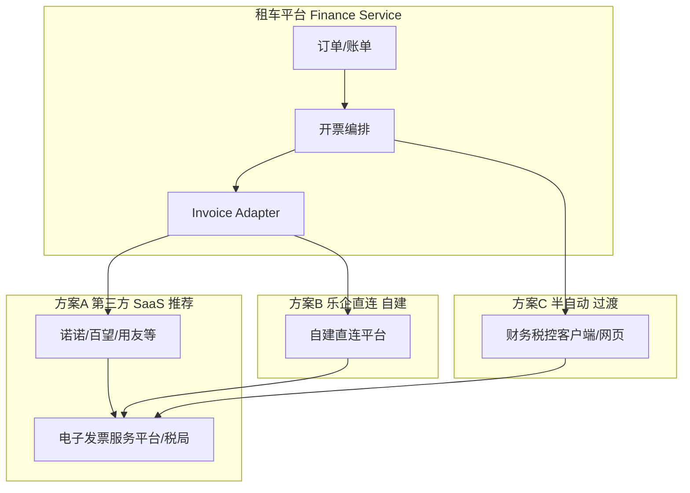

# 租车平台订单开票方案 — 第三方 vs 自建（可行性 / 成本 / 风险）

版本：1.0  
日期：2026-06-01  
关联需求：FR-FIN-002 ~ FR-FIN-009、BR-006、BR-020、P-FINANCE

---

## 1. 业务背景（本项目）

| 维度 | 说明 | 对开票方案的影响 |
|---|---|---|
| 客户结构 | B/G 为主，**先用车后结算** | 大量 **企业抬头**、月结合并开票 |
| 回款方式 | 凭 **发票** 对公打款 | 发票须带 **回款识别码**、与账单/订单勾稽 |
| 车队规模 | 约 **200 台** | 开票量中等，非超大规模 |
| 规则复杂度 | 抬头多样、合并/拆分、部分红冲 | 需要 **可配置开票规则 + 人工兜底** |
| 平台现状 | 已有 `invoices`、账单、抬头库、开票就绪编排 | 缺 **税局侧真实开票能力**（Adapter 层） |

**一期目标**：订单/账单结算完成后，自动或半自动开具 **数电发票（全电发票）**，回写发票号、PDF/OFD 链接，并与对公回款闭环。

---

## 2. 方案总览



| 方案 | 一句话 | 一期推荐度 |
|---|---|---|
| **A. 第三方开票 SaaS** | 平台 API 对接成熟服务商，快速合规 | ★★★★★ **首选** |
| **B. 乐企自用直连（自建）** | 企业信息系统直连税局乐企平台 | ★★ 仅大型集团可考虑 |
| **C. 半自动（平台申请 + 财务开票）** | 平台生成开票单，人工在税局/客户端开具 | ★★★ 可作 MVP 过渡 |
| **D. 传统税控盘/UKey 自建** | 本地税控 + 自研对接 | ★ 已淘汰，不建议 |

---

## 3. 方案 A：第三方开票服务（推荐）

### 3.1 主流服务商对比

| 维度 | 诺诺发票（航天信息系） | 百望云 | 用友税务云 / 金蝶 |
|---|---|---|---|
| 定位 | 发票 SaaS + 开放 API，中小企业覆盖广 | 业财税一体，中大型企业 | 已有 ERP/财务系统时顺接 |
| 数电票 | 支持 | 支持 | 支持 |
| API 能力 | 开票、红冲、查询、回调、交付 | 同左，批量与归档强 | 与 ERP 深度集成 |
| 典型对接 | REST + 异步回调 | REST + 回调 | OpenAPI / 友企联 |
| 实施周期 | **2~4 周** | **2~4 周** | **4~8 周**（含 ERP） |
| 运维 | 厂商负责税局规则升级 | 同左 | 依赖 ERP 版本 |

> 其他：高灯、腾讯电子发票、阿里发票平台等，选型逻辑类似 — **有成熟数电 API + 本地实施伙伴即可**。

### 3.2 平台对接架构（与现有设计一致）

```pseudo
ON bill.status == PAID AND invoice_ready:
  req = buildInvoiceRequest(
    bill_id, order_lines, title from org_invoice_title,
    tax_code=3040502020000000000,  // 有形动产经营租赁，以财务为准
    amount, tax_rate, buyer_tax_no
  )
  result = invoiceAdapter.issue(provider=NUONUO|BAIWANG, req)
  IF result.async:
    SET invoice.status = ISSUING
  ON callback(success):
    UPDATE invoice(invoice_no, pdf_url, ofd_url)
    EMIT rental.finance.invoice_generated
```

**与 P-FINANCE 衔接**

- 对公 **回款识别码** 写入发票备注/销货清单备注（FR-FIN-007）
- **先开后票** 场景：B/G 账单 `PENDING_CONFIRM` 确认后可配置「确认即开票」或「回款后开票」（需客户定规则）
- 红冲：退款/账单调减时走 **红字数电票**，平台记录 `red_flush_ref_id`

### 3.3 成本估算（200 台车队 · 粗算）

| 成本项 | 区间（首年） | 说明 |
|---|---|---|
| SaaS 基础费 | ¥3,000 ~ ¥15,000 / 年 | 单主体、单税号；多门店/多主体递增 |
| 按量费 | ¥0.05 ~ ¥0.3 / 张 或 包年张数 | 部分厂商含在套餐内 |
| 实施/对接 | ¥8,000 ~ ¥30,000（一次性） | 含字段映射、回调、红冲、UAT |
| 短信/邮件交付 | ¥0.05 ~ ¥0.1 / 条 | 可选 |

**开票量假设**

| 场景 | 月开票张数（估） | 第三方按 ¥0.1/张 | 首年 SaaS+按量 |
|---|---|---:|---:|
| B/G 月结为主 | 80 ~ 200 张/月 | ¥960 ~ ¥2,400/年 | 约 **¥1万 ~ ¥2.5万/年**（含基础费） |
| + C 端零散 | +50 ~ 100 张/月 | +¥600 ~ ¥1,200/年 | 略增 |

> 以上为市场经验区间，**以诺诺/百望商务报价为准**；远低于自建乐企。

### 3.4 可行性

| 项 | 评估 |
|---|---|
| 技术 | **高** — REST + 回调，与现有 Finance Service、事件 `invoice_generated` 契合 |
| 合规 | **高** — 服务商承担税局规则变更、数电通道 |
| 业务 | **中高** — B/G 合并开票、多抬头需 **规则引擎 + 人工审核**（`autoAudit=false` 或平台审批） |
| 周期 | **2~4 周** 可上线基础蓝票 + 回调 + 下载 |

### 3.5 风险

| 风险 | 等级 | 缓解 |
|---|---|---|
| 服务商 API 不稳定 | 中 | 异步重试、死信转财务工单（同对公支付 R7） |
| 税收分类编码/税率配置错误 | 高 | 财务定稿税编；上线前 20 单灰度 |
| B/G 合并开票与订单明细不一致 | 高 | 账单行 ↔ 发票行映射表 + 日终对账 |
| 先开票后回款与坏账 | 中 | 授信 + 账龄看板（FR-FIN-009） |
| 厂商锁定 | 低~中 | Adapter 抽象 `InvoiceProvider`，保留切换能力 |
| 数据安全 | 中 | HTTPS、密钥托管、日志脱敏 |

---

## 4. 方案 B：乐企自用直连（自建）

### 4.1 是什么

企业 **自有信息系统** 按税务总局规则改造，**直连乐企平台**，在系统内完成数电票开具、归集、部分申报能力。**不经过** 诺诺/百望等第三方开票 SaaS（或仅作备用）。

### 4.2 接入门槛（摘录各地指引，以主管税局为准）

| 条件 | 典型要求 |
|---|---|
| 纳税人 | 已纳入 **数电票试点** |
| 纳税信用 | 多为 **A/B 级** |
| 开票量 | 如：前 12 个月开票+受票 **≥ 1万~5万份** 或金额 **≥ 1亿元**（各省细则不同） |
| 能力 | 自有系统 **软件著作权**、网络安全与运维体系 |
| 责任 | 直连单位对 **数据安全、报送、下属单位监管** 负主责 |

**对本客户（约 200 台租赁）**：年开票量若仅 **数千~一万张**，**通常不满足** 乐企自用门槛；且不具备大型集团 IT 编制。

### 4.3 成本估算

| 成本项 | 区间 | 说明 |
|---|---|---|
| 乐企接入咨询 + 安全测评 | ¥10万 ~ ¥50万 | 视省份与集成商 |
| 系统改造（嵌入规则、联调） | ¥30万 ~ ¥150万 | 业财税一体改造量大 |
| 硬件/专线/等保 | ¥5万 ~ ¥30万 / 年 | 视等保级别 |
| 专职运维 + 税务 IT | ¥20万 ~ ¥60万 / 年 | 2~3 人起 |
| 税局规则变更跟随 | 持续 | 每次能力升级需联调 |

**首年 TCO 粗算：¥50万 ~ ¥250万+**，且 **6~12 个月** 才可能稳定投产。

### 4.4 可行性

| 项 | 评估 |
|---|---|
| 技术 | **低~中**（对中小租赁企业） |
| 合规 | **高**（直连税局，但责任也在企业） |
| 业务 | **高**（规则完全自控） |
| 周期 | **6~12 个月**，不适合一期 MVP |

### 4.5 风险

| 风险 | 等级 | 说明 |
|---|---|---|
| **准入不通过** | 高 | 开票量、信用、IT 能力不达标 |
| 建设超支、延期 | 高 | 规则复杂，联调周期长 |
| 安全与数据责任 | 高 | 泄露、误开票直连单位担责 |
| 规则变更维护 | 中~高 | 税局能力版本升级需持续投入 |
| 机会成本 | 高 | 资源应从「租车数字化」分散到「税务基建」 |

**结论**：除非客户为 **大型集团总部** 且已有乐企资格，否则 **不建议** 作为本项目一期方案。

---

## 5. 方案 C：半自动（过渡 / 并行）

### 5.1 做法

1. 平台：账单 `PAID` / 开票就绪 → 生成 **开票申请单**（PDF/Excel 或财务后台列表），含抬头、税号、明细、识别码。  
2. 财务：在 **电子税务局网页** 或 **诺诺/百望客户端**（不开 API）手工开具。  
3. 平台：财务 **回录** 发票号 + PDF 链接，或批量导入。

### 5.2 成本

| 项 | 费用 |
|---|---|
| 平台侧（申请单 + 回录） | ¥5,000 ~ ¥15,000 开发 |
| 第三方 SaaS | ¥0 ~ ¥3,000/年（若仅用客户端） |
| 人力 | 每单 **3~8 分钟** × 财务时薪 |

200 张/月 ≈ **33~67 小时/月** 财务人工 — 与痛点「手工、难对齐」部分重合，**仅适合一期 1~2 个月过渡**。

### 5.3 风险

| 风险 | 等级 |
|---|---|
| 订单-发票-回款仍易脱节 | 高 |
| 人为差错（金额、抬头） | 中~高 |
| 无法支撑 C 端即时开票体验 | 中 |

---

## 6. 方案 D：传统税控盘 / UKey 自建（不推荐）

- 金税盘/税控盘 + 本地开票服务器：**已被数电票替代**，新立项不应采用。  
- 维护成本高、无法与云端租车平台自然集成。  
- **结论**：仅作历史系统兼容说明，**不纳入选型**。

---

## 7. 租车场景开票规则补充（实施必谈）

| 规则 | 建议 |
|---|---|
| 开票时点 | C 端：**结算且支付成功后**（BR-006）；B/G：可选「账单确认后」或「回款后」，需客户书面定稿 |
| 发票类型 | 数电 **专票/普票**；B/G 多为专票 |
| 商品名称 | 「车辆租赁费」「*经营租赁*租车费」等，税编 **3040502020000000000**（以财务为准） |
| 税率 | 一般 **13%**（具体以财务与税局核定为准） |
| 合并开票 | 同一 B/G 主体 + 同一账期 → **一张发票多行明细** |
| 拆分 | 不同抬头 / 不同税率 / 超单张限额 → 拆多张，平台生成 `invoice_batch` |
| 红冲 | 退款、账单调减、错票 → 红字数电票，关联原 `invoice_id` |
| 备注 | 写入 **账单号、回款识别码、租期、车牌**（便于客户对公付款） |

---

## 8. 综合对比矩阵

| 维度 | A 第三方 SaaS | B 乐企自建 | C 半自动 | D 税控 legacy |
|---|---|---|---|---|
| 首年成本 | **低**（1~3 万级） | **极高**（50 万+） | 低+高人力 | 中（且过时） |
| 上线周期 | **2~4 周** | 6~12 月 | 1~2 周 | — |
| 合规 | 高 | 高 | 中 | 低 |
| 与订单闭环 | **高** | 高 | 低 | 低 |
| B/G 复杂规则 | 中高（可配置） | 高 | 低 | 低 |
| 200 台车队适配 | **最佳** | 过度建设 | 仅过渡 | 否 |
| 主要风险 | API/映射 | 门槛/成本/责任 | 人工差错 | 政策淘汰 |

---

## 9. 推荐决策

### 9.1 一期（MVP）

**采用方案 A：第三方数电开票 SaaS**（诺诺或百望二选一，商务比价）

- 平台实现 `Invoice Adapter` + 异步回调 + 红冲接口  
- B/G：**账单确认 → 开票就绪 → 自动/审批开票**；发票备注带 **回款识别码**  
- C 端：订单 `PAID` 后用户申请，自动开普票  
- 保留 **方案 C** 作 API 故障时财务兜底（人工开票 + 回录）

### 9.2 二期（增强）

- 合并/拆分规则配置化、发票-银行流水-订单 **三向勾稽报表**  
- 进项票归集（若客户需要成本票管理）可复用同一厂商  

### 9.3 不建议

- 一期上 **乐企自建**（除非客户已是乐企直连单位且 IT 预算充足）  
- 任何 **新购税控盘** 方案  

---

## 10. 平台落地清单（方案 A）

- [ ] 选定服务商并完成 **数电试点** 主体认证  
- [ ] 确定税编、税率、商品名称、是否含税  
- [ ] 开发 `InvoiceProvider` 接口：issue / query / redFlush / callback  
- [ ] 扩展 `invoices` 及明细/日志表 — 见 **V8 迁移** 与 [integration-invoice-adapter-v1.md](./03-API/规范/integration-invoice-adapter-v1.md)
- [ ] 配置 B/G 开票策略：`ON_BILL_CONFIRM` vs `ON_PAYMENT`  
- [ ] 灰度 20 单：正常、缺字段、红冲  
- [ ] 日终对账：∑订单结算额 ≈ ∑蓝票 − ∑红票  

---

## 11. 关联文档

- [租车平台业务背景与客户痛点说明.md](../租车平台业务背景与客户痛点说明.md) §3.3  
- [租车平台需求规格说明书.md](../租车平台需求规格说明书.md) §3.5  
- [租车平台第三方接口与成本控制说明.md](../租车平台第三方接口与成本控制说明.md)  
- [租车平台客户签约版成本测算（首年TCO）.md](../租车平台客户签约版成本测算（首年TCO）.md)  
- [integration-shumai-violation-v1.md](./integration-shumai-violation-v1.md)（Adapter 模式参考）

---

## 12. 变更记录

| 版本 | 日期 | 说明 |
|---|---|---|
| v1.0 | 2026-06-01 | 初版：第三方 vs 乐企自建 vs 半自动对比 |
| v1.1 | 2026-06-01 | 关联 RFP 比价表与 Invoice Adapter 规范 |

---

## 13. 附件

- [租车平台开票服务商RFP比价表（诺诺vs百望）.md](./租车平台开票服务商RFP比价表（诺诺vs百望）.md)
- [integration-invoice-adapter-v1.md](./03-API/规范/integration-invoice-adapter-v1.md)
- OpenAPI `openapi-finance-v1.yaml` v1.5 · DDL `V8__invoice_adapter_fields.sql`
