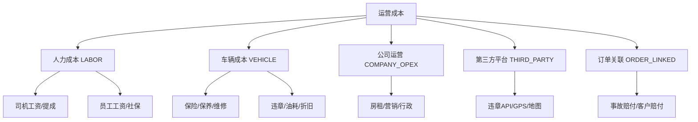

# 租车平台运营成本管理说明

版本：v1.0  
日期：2026-06-01  
适用对象：财务、运营、管理层、产品、研发  
关联文档：[租车平台业务背景与客户痛点说明.md](./租车平台业务背景与客户痛点说明.md)、[租车平台订单定价策略说明.md](./租车平台订单定价策略说明.md)、[租车平台第三方接口与成本控制说明.md](./租车平台第三方接口与成本控制说明.md)

> **口径区分**  
> - **车队运营成本**（本文）：租车公司日常经营支出与车辆全生命周期成本，用于毛利与单车核算。  
> - **平台 IT 成本**（另文档）：软件、云资源、第三方 API 等，见 [客户签约版成本测算（首年TCO）](./租车平台客户签约版成本测算（首年TCO）.md)。

---

## 1. 管理目标

| 目标 | 说明 |
|---|---|
| 成本归集 | 按**时间、门店、车辆、司机、订单、费用类型**多维度入账 |
| 收入联动 | 与订单营收（租金、司机服务费）对比，形成**单车毛利 / 车队毛利** |
| 来源可追溯 | 人工录入、Excel 导入、业务系统自动写入（违章 API、事故、维保工单） |
| 决策支持 | 月/季/年成本结构、异常预警（超预算、单车持续亏损） |

对应痛点 [P-OPS](./租车平台业务背景与客户痛点说明.md#34-无法精细化运营成本与增长数据缺失p-ops)：维修、保险、违章、人力等分散记账 → 统一台账 + 看板。

---

## 2. 成本分类体系（Cost Taxonomy）



### 2.1 一级分类与费用代码

| 一级代码 | 名称 | 典型子类（`cost_sub_type`） | 主要归集维度 |
|---|---|---|---|
| `LABOR` | **人力成本** | 见 §3.1 | 司机、门店、部门、月份 |
| `VEHICLE` | **车辆支出与损耗** | 见 §3.2 | **车辆**、门店、月份 |
| `COMPANY_OPEX` | **公司运营支出** | 见 §3.3 | 公司、门店、月份 |
| `THIRD_PARTY` | **第三方平台费用** | 见 §3.4 | 车辆/租户、月份（多自动） |
| `ORDER_LINKED` | **订单关联成本** | 事故赔付、客服赔付、过路代收等 | 订单、车辆 |

---

## 3. 分维度成本明细

### 3.1 人力成本（LABOR）

| 子类代码 | 名称 | 说明 | 录入方式 |
|---|---|---|---|
| `DRIVER_BASE_SALARY` | 司机基本工资 | 包车司机固定月薪 | 人事月度导入 |
| `DRIVER_TRIP_COMMISSION` | 司机提成 | 按单/按天/按里程提成 | 系统按 `order` + 规则计算或导入 |
| `DRIVER_ALLOWANCE` | 司机补贴 | 餐补、住宿、长途补贴 | 人工/导入 |
| `DRIVER_SOCIAL_INSURANCE` | 司机社保公积金 | 企业承担部分 | 财务月度导入 |
| `STAFF_SALARY` | 员工工资 | 运营、销售、客服、管理 | 人事月度导入 |
| `STAFF_SOCIAL_INSURANCE` | 员工社保公积金 | — | 财务月度导入 |
| `STAFF_BONUS` | 奖金绩效 | 季度/年度 | 人工 |
| `OUTSOURCED_LABOR` | 外包劳务 | 代驾、临时装卸 | 人工 |

**司机成本与订单联动**（`WITH_DRIVER`）：

- 收入侧：`orders.chauffeur_fee`（对客户收取）
- 成本侧：`DRIVER_*`（对司机支出）
- 指标：**司机单均毛利** = 司机服务费收入 − 分摊司机成本

### 3.2 车辆支出与损耗（VEHICLE）

| 子类代码 | 名称 | 说明 | 录入/来源 |
|---|---|---|---|
| `VEHICLE_DEPRECIATION` | 折旧 | 自有车辆直线/工作量法 | 财务规则按月计提 |
| `VEHICLE_LEASE` | 融资租赁/租赁费 | 租车公司租入车辆 | 合同按月 |
| `INSURANCE_COMPULSORY` | 交强险 | 按年投保，按月摊销 | 保单录入 |
| `INSURANCE_COMMERCIAL` | 商业险 | 车损、三者等 | 保单录入 |
| `MAINTENANCE_ROUTINE` | **保养** | 按里程/周期保养 | 维保工单 |
| `REPAIR` | **维修** | 故障维修、事故维修（客户承担部分除外） | 维保工单/事故单 |
| `VIOLATION_FINE` | **违章罚款** | 实际处罚金额（非 API 查询费） | 违章结果回填/人工 |
| `VIOLATION_POINTS_SERVICE` | 违章代办费 | 代处理服务费 | 人工 |
| `FUEL` | 油费 / 电费 | 油卡、充电 | 导入/GPS油耗估算 |
| `TIRE` | 轮胎更换 | — | 维保工单 |
| `ANNUAL_INSPECTION` | **年审** | 检测费 | 到期提醒+录入 |
| `PARKING_TOLL` | 停车/过路桥费 | 公司承担部分 | 人工/导入 |
| `VEHICLE_TAX` | 车船税等 | — | 财务 |
| `GPS_HARDWARE` | GPS 硬件摊销 | 终端采购 | 资产台账 |
| `SCRAP_LOSS` | 报废损耗 | 处置损失 | 一次性 |

**损耗与状态**：车辆 `MAINTENANCE` / `ACCIDENT_HOLD` 期间可标记「停运天数」，用于**利用率与机会成本**分析（不出租损失租金）。

### 3.3 公司日常运营支出（COMPANY_OPEX）

| 子类代码 | 名称 | 说明 |
|---|---|---|
| `OFFICE_RENT` | 办公场地租金 | 总部/门店办公室 |
| `UTILITIES` | 水电物业 | — |
| `MARKETING` | 市场推广 | 投放、活动 |
| `TRAVEL_ENTERTAINMENT` | 差旅招待 | — |
| `ADMIN_OFFICE` | 行政办公 | 耗材、快递 |
| `LEGAL_AUDIT` | 法务审计 | — |
| `FINANCE_BANK_FEE` | 银行手续费 | 对公、POS |
| `IT_SAAS` | 业务软件订阅 | 非本平台类 SaaS |
| `DAILY_MISC` | **日常杂费** | 未归类小额，需备注 |

可按 **门店** 或 **全公司** 分摊：配置 `allocation_rule`（见 §5.3）。

### 3.4 第三方平台费用（THIRD_PARTY，多自动）

与 [第三方接口与成本控制说明](./租车平台第三方接口与成本控制说明.md) 衔接，写入统一成本台账：

| 子类代码 | 名称 | 来源 |
|---|---|---|
| `API_VIOLATION_QUERY` | 违章查询 API | `integration_cost_ledger`（¥0.06/次） |
| `API_GPS_PLATFORM` | GPS 平台/流量费 | 合同分摊录入或供应商账单 |
| `API_MAP` | 地图商用 | 按量账单 |
| `API_INVOICE_SAAS` | 数电发票 SaaS | 年度摊销 |
| `API_SMS` | 短信验证码 | 按条 |

### 3.5 订单关联成本（ORDER_LINKED）

| 子类代码 | 名称 | 来源 |
|---|---|---|
| `ACCIDENT_PAYOUT` | 事故赔付 | `order_incident_fee`、保险理赔差额 |
| `CUSTOMER_COMPENSATION` | 客诉赔付 | 客服工单 |
| `ORDER_FUEL_SHORT` | 油费差额（客户未付） | 还车结算 |
| `COLLECTION_FEE` | 催收/法务 | 逾期账单 |

---

## 4. 归集维度（Analysis Dimensions）

| 维度 | 字段 | 用途 |
|---|---|---|
| **时间** | `cost_date`、`accrual_month`（YYYY-MM） | 日/月/季/年报表 |
| **门店** | `store_id` | 门店 P&L |
| **车辆** | `vehicle_id`、`vehicle_type_id` | **单车成本表**、车型对比 |
| **司机** | `driver_id` | 司机成本与产出 |
| **订单** | `order_id` | 单笔订单毛利 |
| **部门** | `dept_code` | 公司管理费分摊 |
| **客户** | `billing_account_id`（B/G） | 大客户贡献度（收入−分摊成本） |
| **费用类型** | `cost_category`、`cost_sub_type` | 结构分析 |

**单车全成本（月）示意**：

```
vehicle_month_cost = sum(cost where vehicle_id = X and accrual_month = M)
vehicle_month_revenue = sum(order revenue allocated to vehicle X in M)
vehicle_gross_margin = vehicle_month_revenue - vehicle_month_cost
```

---

## 5. 数据模型与录入

> **DDL 已落地**：`Migrations/Flyway/V9__operating_cost_management.sql`（Liquibase 同步）。数据字典见 [数据字典-v2.0运营成本与定价.md](./04-数据库/数据字典-v2.0运营成本与定价.md)。

### 5.1 主表 `operating_cost_entry`（建议）

| 字段 | 类型 | 说明 |
|---|---|---|
| `id` | uuid | 主键 |
| `entry_no` | varchar | 单据号 |
| `cost_category` | varchar | LABOR / VEHICLE / COMPANY_OPEX / THIRD_PARTY / ORDER_LINKED |
| `cost_sub_type` | varchar | §3 子类代码 |
| `amount` | numeric(12,2) | 含税金额（口径在配置中统一） |
| `tax_amount` | numeric(12,2) | 可空 |
| `cost_date` | date | 发生日 |
| `accrual_month` | varchar(7) | 权责发生月 |
| `store_id` | uuid | 可空 |
| `vehicle_id` | uuid | 可空 |
| `driver_id` | uuid | 可空 |
| `order_id` | uuid | 可空 |
| `dept_code` | varchar | 可空 |
| `source` | enum | `MANUAL` / `IMPORT` / `AUTO_API` / `WORK_ORDER` / `INCIDENT` |
| `source_ref_id` | uuid | 关联任务/工单/事故单 |
| `vendor_name` | varchar | 供应商 |
| `invoice_no` | varchar | 发票号 |
| `attachment_urls` | jsonb | 凭证 |
| `remark` | text | — |
| `status` | enum | DRAFT / CONFIRMED / VOID |
| `created_by` | uuid | 审计 |

### 5.2 预算表 `operating_cost_budget`（可选一期 P2）

| 字段 | 说明 |
|---|---|
| `accrual_month` + `store_id` + `cost_sub_type` | 月度预算额 |
| `alert_threshold` | 达 80%/100% 告警 |

### 5.3 分摊规则 `cost_allocation_rule`

| 规则 | 说明 |
|---|---|
| `COMPANY_OPEX_BY_REVENUE` | 总部费用按门店营收比例分摊 |
| `COMPANY_OPEX_BY_VEHICLE_COUNT` | 按门店车辆数分摊 |
| `INSURANCE_BY_VEHICLE` | 保费直接归车辆 |
| `DRIVER_SALARY_BY_ORDER` | 司机固定工资按服务单数分摊到订单 |

---

## 6. 数据来源与自动化

| 来源 | 触发 | 写入子类 |
|---|---|---|
| 违章批量任务成功 | FR-EXT-001/003 | `API_VIOLATION_QUERY` → THIRD_PARTY |
| 违章记录确认罚款 | 运营确认 | `VIOLATION_FINE` → VEHICLE |
| 维保工单完成 | 车辆模块 | `MAINTENANCE_ROUTINE` / `REPAIR` |
| 保险/年审到期提醒 | FR-VEH 扩展 | 到期未录入告警 |
| 事故费用确认 | FR-ORD-010 | `ACCIDENT_PAYOUT` / `REPAIR` |
| 订单还车油费差额 | 结算 | `ORDER_FUEL_SHORT` |
| 人事/财务 Excel | 月度导入 | `DRIVER_*`、`STAFF_*`、`COMPANY_OPEX` |
| GPS/发票供应商账单 | 财务录入 | `API_GPS_PLATFORM`、`API_INVOICE_SAAS` |

```pseudo
FUNCTION recordAutoCost(event):
  IF event.type == VIOLATION_QUERY_SUCCESS:
    insert operating_cost_entry(
      category=THIRD_PARTY, sub_type=API_VIOLATION_QUERY,
      amount=event.unit_cost, vehicle_id=event.vehicle_id,
      source=AUTO_API, source_ref_id=event.task_id
    )
  IF event.type == INCIDENT_FEE_CONFIRMED:
    insert operating_cost_entry(
      category=ORDER_LINKED, sub_type=ACCIDENT_PAYOUT,
      amount=event.amount, order_id=event.order_id, vehicle_id=event.vehicle_id,
      source=INCIDENT, source_ref_id=event.incident_id
    )
```

---

## 7. 报表与看板

### 7.1 成本看板（扩展 FR-OPS-007）

| 看板 | 维度 | 指标 |
|---|---|---|
| **成本总览** | 月/季/年 | 总成本、同比、占营收比 |
| **成本结构** | 一级分类 | 人力 / 车辆 / 公司 / 第三方 占比饼图 |
| **车辆成本排行** | 单车 | 保险+维保+维修+违章+折旧 Top N |
| **司机成本** | 司机 | 工资+补贴 vs 司机服务费收入 |
| **门店 P&L** | 门店 | 营收 − 直接成本 − 分摊费用 = 营业利润 |
| **预算执行** | 月 | 预算 vs 实际、超支预警 |
| **异常清单** | — | 单月维修费>阈值、单车连续 3 月亏损 |

### 7.2 与营收看板联动（FR-OPS-004）

| 指标 | 公式 |
|---|---|
| 车队毛利率 | `(营收 − 运营成本) / 营收` |
| 单车毛利率 | `(单车营收 − 单车成本) / 单车营收` |
| 单车日均成本 | `单车月成本 / 可用天数` |
| 违章成本率 | `违章相关成本 / 单车营收` |

营收口径：租金、司机服务费、违约金等（见 [订单定价策略说明](./租车平台订单定价策略说明.md)）。

---

## 8. 业务规则

| 编号 | 规则 |
|---|---|
| BR-CST-001 | 已 `CONFIRMED` 成本条目仅允许红冲作废，不可物理删除 |
| BR-CST-002 | 同一 `source_ref_id` + `cost_sub_type` 不得重复入账（幂等） |
| BR-CST-003 | `API_VIOLATION_QUERY` 必须与 `integration_cost_ledger` 可对账 |
| BR-CST-004 | `VIOLATION_FINE` 与 `API_VIOLATION_QUERY` 分账，不得混为一类 |
| BR-CST-005 | 车辆折旧/租赁费按月计提，计入 `accrual_month` |
| BR-CST-006 | 公司级 `COMPANY_OPEX` 须通过分摊规则落到门店/车辆（可配置是否展示两层） |
| BR-CST-007 | 事故维修费：客户承担部分计入订单应收，企业承担部分计入 `REPAIR`/`ACCIDENT_PAYOUT` |
| BR-CST-008 | 成本录入超过 `budget × threshold` 触发运营/财务审批（可选） |
| BR-CST-009 | 导出财务报表须带 `entry_no`、凭证号、录入人、确认时间 |

---

## 9. 功能需求（建议纳入 SRS）

| 编号 | 需求摘要 | 优先级 |
|---|---|---|
| FR-OPS-012 | 运营成本台账：录入、导入、确认、作废、附件 | P1 |
| FR-OPS-013 | 成本分类与子类可配置（启用/停用） | P1 |
| FR-OPS-014 | 多维度报表：时间/门店/车辆/司机/费用类型 | P1 |
| FR-OPS-015 | 单车/车队毛利分析（成本 vs 订单营收） | P1 |
| FR-OPS-016 | 月度预算与超支预警 | P2 |
| FR-OPS-017 | 公司费用分摊规则配置与执行 | P2 |
| FR-VEH-006 | 维保工单（保养/维修）与成本自动入账 | P1 |
| FR-VEH-007 | 保险/年审记录与到期提醒、保费摊销 | P1 |
| FR-EXT-009 | 违章罚款金额回填并生成 `VIOLATION_FINE` 成本（可选） | P2 |

扩展 **FR-OPS-007**：在原有「维保、违章查询、事故赔付、第三方接口」基础上，覆盖 §2 全部分类。

---

## 10. 200 台车队 — 月度成本结构示例（管理参考，非报价）

| 大类 | 月均区间（万元） | 备注 |
|---|---:|---|
| 人力（司机+员工） | 8 ~ 25 | 包车占比高则偏高 |
| 保险 | 3 ~ 8 | 按车型差异大 |
| 保养+维修 | 2 ~ 10 | 车龄与事故率敏感 |
| 燃油/电费 | 5 ~ 15 | 利用率相关 |
| 违章罚款+代办 | 0.5 ~ 3 | 与风控相关 |
| 折旧/租赁 | 10 ~ 30 | 资产结构决定 |
| 公司运营 | 2 ~ 8 | 总部+门店 |
| 第三方 API | < 0.1 | 违章 API 极低，GPS/地图按合同 |

> 用于向客户说明「平台看板价值」：将分散 Excel 归一为可对标营收的台账；**非**软件采购 TCO。

---

## 11. 验收要点

- [ ] 手工录入保养费 500 元 → 车辆维度月报表可见，状态为已确认
- [ ] 违章 API 成功 200 次 → 自动生成 THIRD_PARTY 成本 ¥12，与 integration 台账一致
- [ ] 事故确认企业承担维修费 → ORDER_LINKED + 订单毛利减少
- [ ] 司机月工资导入 → 司机维度成本与司机服务费收入同屏对比
- [ ] 公司房租按营收分摊 → 各门店 P&L 含分摊行
- [ ] 作废条目保留审计痕迹，报表不重算错误

---

## 12. 相关文档

| 文档 | 关系 |
|---|---|
| [租车平台订单定价策略说明.md](./租车平台订单定价策略说明.md) | 收入侧定价 |
| [租车平台第三方接口与成本控制说明.md](./租车平台第三方接口与成本控制说明.md) | API 成本自动入账 |
| [租车平台需求规格说明书.md](./租车平台需求规格说明书.md) | FR-OPS-004/007 |
| [租车平台业务背景与客户痛点说明.md](./租车平台业务背景与客户痛点说明.md) | P-OPS 痛点 |
