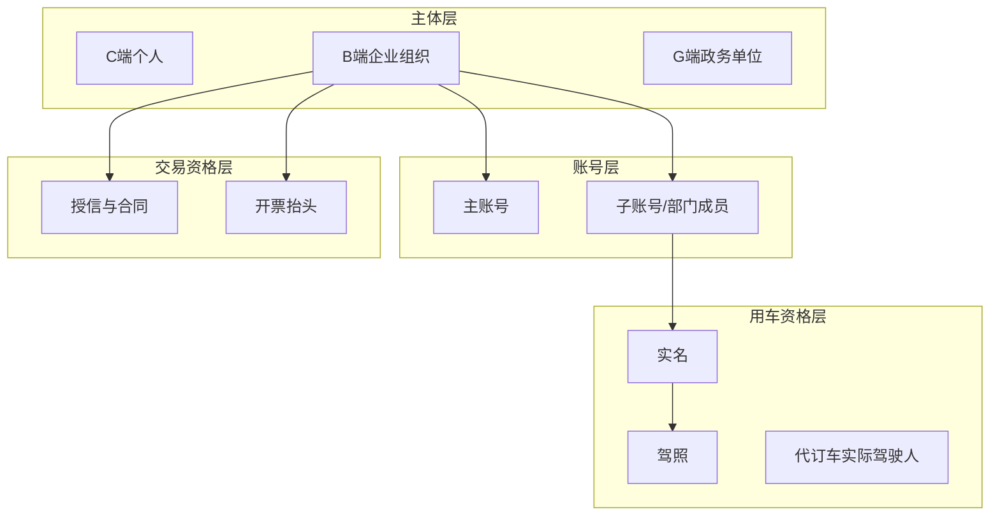

# 租车平台需求补充说明书（事故处理 + 用户认证细化）

版本：1.0  
日期：2026-06-01  
适用范围：在《租车平台需求规格说明书》v1.8+ 基础上补充  
关联文档：[租车平台业务背景与客户痛点说明.md](./租车平台业务背景与客户痛点说明.md)、[租车平台需求规格说明书.md](./租车平台需求规格说明书.md)

---

## 1. 补充背景

客户车队约 **200 辆**，B/G 客户占比高，存在 **租期中使用中事故** 处置不规范、以及 **多主体、代订车、先开后票** 等复杂认证与结算场景。本说明书将两类补充需求结构化，供产品、研发、测试直接拆解迭代。

---

## 2. 补充范围总览

| 域 | 补充主题 | 新增需求 ID（写入 SRS） |
|---|---|---|
| 订单与履约 | 使用中事故 | FR-ORD-008 ~ FR-ORD-012 |
| 用户与认证 | 分场景认证细化 | FR-USER-011 ~ FR-USER-018 |
| 财务 | 银行流水勾稽 | FR-FIN-007 ~ FR-FIN-009 |
| 运营 | 精细化看板 | FR-OPS-004 ~ FR-OPS-009 |

---

## 3. 使用中事故处理（补充）

### 3.1 业务场景

- 订单状态为 **使用中** 时发生交通事故、单方刮蹭、盗抢等。
- 需同步：车辆是否继续出租、保险报案、客户责任认定、额外费用是否计入账单。
- 与 **还车损伤记录（FR-ORD-004）** 区分：事故单强调 **租期中实时处置**；还车验收强调 **终态定损**。

### 3.2 用户角色

| 角色 | 行为 |
|---|---|
| C/B/G 用车人 | 小程序/APP 上报事故、上传现场照片、填写说明 |
| 门店员工 | 现场确认、补充验车信息、标记车辆停运 |
| 运营管理员 | 审核事故单、协调保险、调整订单状态 |
| 财务管理员 | 登记预估/实际赔付、关联账单调整 |
| 客服人员 | 受理投诉、创建/关联工单 |

### 3.3 功能需求

#### FR-ORD-008：租期事故上报

- 仅 **使用中** 订单可创建事故单（`INCIDENT`）。
- 必填：事故时间、地点（可地图选点）、事故类型（碰撞/刮蹭/盗抢/其他）、现场照片（≥2 张）、联系人电话。
- 选填：交警报案号、保险公司、保单号、第三方车牌、人伤标识（有/无）。

#### FR-ORD-009：事故单状态机与协同

状态建议：

`REPORTED` → `UNDER_REVIEW` → `INSURANCE_PROCESSING` → `RESOLVED` / `CLOSED`

- 支持指派处理人、内部备注、附件追加（事故认定书、维修清单）。
- 事故单 **必须关联** `order_id`、`vehicle_id`、用车人 `user_id`。
- 创建事故单后，可选将车辆状态置为 **事故停运**（`ACCIDENT_HOLD`），该车辆不再参与可租检索（BR-030）。

#### FR-ORD-010：订单与计费影响

- 支持 **暂停计费** / **延长租期**（需审批）两种策略，记录原因与审批人。
- 支持生成 **事故相关费用项**（拖车费、停运费、免赔额、加速折旧等），进入待结算账单。
- 与 FR-ORD-004 联动：还车时若已有开放事故单，还车验收需引用事故单结论，避免重复定损。

#### FR-ORD-011：保险与第三方协同（一期可半自动）

- 记录保险报案时间、报案号、理赔状态（待报案/已报案/定损中/已赔付/拒赔）。
- 支持导出事故材料包（PDF/ZIP）供线下保险公司对接。
- 二期可对接保险 API（Out of Scope 本补充一期）。

#### FR-ORD-012：事故统计与审计

- 管理后台按时间、门店、车型、客户类型统计事故率。
- 所有状态变更、费用调整 **100% 审计**（操作人、时间、前后值）。

### 3.4 业务规则（写入 SRS BR-030 ~ BR-034）

- **BR-030**：车辆处于 `ACCIDENT_HOLD` 时，禁止新订单占用该时间窗资源。
- **BR-031**：开放事故单未 `RESOLVED` 前，订单不得进入 **已完成**；允许进入 **待结算** 但需标记 `incident_pending=true`。
- **BR-032**：事故费用计入账单前，须由运营或财务角色确认（职责分离：上报人不可单独确认金额）。
- **BR-033**：涉及人伤的事故，系统强制创建高优先级工单并通知客服（不可关闭为静默）。
- **BR-034**：同一订单可有多条事故记录，但仅允许一条处于 `UNDER_REVIEW` 或 `INSURANCE_PROCESSING` 的「主事故单」。

### 3.5 核心流程（伪代码）

```
ON incident_report(order_id, payload):
  ASSERT order.status == IN_USE
  CREATE incident(status=REPORTED, ...)
  IF payload.requires_vehicle_hold:
    SET vehicle.status = ACCIDENT_HOLD
  CREATE ticket(priority=HIGH if payload.has_injury else NORMAL)
  NOTIFY ops_and_store(order.store_id)

ON incident_resolve(incident_id, settlement):
  REQUIRE ops_or_finance_role
  APPLY fee_lines to order.pending_settlement
  SET incident.status = RESOLVED
  IF vehicle.repair_complete:
    SET vehicle.status = AVAILABLE (after inspection)
  IF order.ready_for_return:
    ALLOW transition to PENDING_SETTLEMENT
```

### 3.6 验收标准

- **AC-017**：使用中订单可创建事故单，非使用中订单拒绝并返回明确错误码。
- **AC-018**：事故单全状态流转可审计，且与订单、车辆、工单关联可查。
- **AC-019**：事故费用确认后进入账单，还车验收可引用事故结论，无重复计费。
- **AC-020**：`ACCIDENT_HOLD` 车辆不可被新订单占用（AC-003 防超卖扩展）。

---

## 4. 用户认证需求细化（补充）

### 4.1 认证分层模型



### 4.2 C 端个人用户

| 需求 ID | 描述 | 规则要点 |
|---|---|---|
| FR-USER-011 | 注册登录强化 | 手机号唯一；支持微信/支付宝绑定与解绑；设备指纹可选记录 |
| FR-USER-012 | 实名认证细化 | 姓名+身份证号+人脸/证件 OCR；状态：`PENDING`/`APPROVED`/`REJECTED`；驳回原因可见 |
| FR-USER-013 | 驾照认证细化 | 准驾车型、初次领证日期、有效期；到期前 30/7 天提醒；过期自动禁止下单 |
| FR-USER-014 | 下单前资格校验 | 聚合校验：实名通过 + 驾照有效 + 非黑名单 + 无逾期未结账单（B 端成员适用组织账单） |

**BR-035**：C 端下单接口必须在网关层调用「用车资格快照」，快照 ID 写入订单便于事后追溯。

### 4.3 B 端企业客户

| 需求 ID | 描述 | 规则要点 |
|---|---|---|
| FR-USER-015 | 企业主体资质 | 营业执照、统一社会信用代码、法人信息、对公账户；审核通过后方可开通 `POSTPAID` |
| FR-USER-016 | 成员与用车人模型 | 主账号、子账号；支持 **代订车**：下单人 ≠ 实际驾驶人时，须登记驾驶人实名+驾照并关联订单 |
| FR-USER-017 | 企业授信与合同 | 授信额度、账期天数、合同编号与有效期；超额或逾期自动冻结下单（衔接 BR-009） |
| FR-USER-018 | 企业开票抬头库 | 多抬头管理、默认抬头、税号校验；与 FR-FIN-003 共用；账单开票必须带抬头 ID |

**BR-036**：`POSTPAID` 订单创建时校验组织授信；快照记录 `credit_limit`、`used_amount`、`contract_id`。

**BR-037**：代订车场景下，实际驾驶人未通过驾照校验则订单不得进入「已确认」。

### 4.4 G 端政务客户

在 B 端能力基础上增加：

| 要点 | 说明 |
|---|---|
| 主体类型 | 机关/事业单位法人证书或统一社会信用代码 |
| 审批加强 | 成员开通、大额订单、账期确认可走 **多级审批**（可配置 2~3 级） |
| 集中采购 | 支持部门预算科目编码（可选字段），便于客户内部 ERP 对接 |
| 数据合规 | 操作日志保留周期 ≥ 3 年（对齐 NFR-SEC） |

### 4.5 后台与风控认证

| 需求 ID | 描述 |
|---|---|
| FR-USER-019 | 后台账号支持 RBAC + 数据范围（门店/区域） |
| FR-USER-020 | 高风险操作 MFA：退款审批、授信调整、账单冲销、权限变更（衔接 BR-007） |
| FR-USER-021 | 认证资料脱敏展示；下载/导出需权限并审计 |

### 4.6 认证状态一览（建议）

**个人实名**

| 状态 | 含义 | 可下单 |
|---|---|---|
| NOT_SUBMITTED | 未提交 | 否 |
| PENDING | 审核中 | 否 |
| APPROVED | 通过 | 是（需驾照有效） |
| REJECTED | 驳回 | 否 |

**企业组织**

| 状态 | 含义 | 可先用后付 |
|---|---|---|
| DRAFT | 资料录入中 | 否 |
| UNDER_REVIEW | 资质审核中 | 否 |
| ACTIVE | 正常 | 是（授信内） |
| SUSPENDED | 暂停（逾期等） | 否 |
| CLOSED | 已注销 | 否 |

### 4.7 验收标准

- **AC-021**：C 端未实名或驾照过期用户下单被拒绝，错误码与文案明确。
- **AC-022**：B 端代订车订单可查询下单人与实际驾驶人及认证状态。
- **AC-023**：企业资质未 `ACTIVE` 时无法创建 `POSTPAID` 订单。
- **AC-024**：开票抬头税号校验失败时不可开具该企业抬头发票。
- **AC-025**：高风险后台操作触发 MFA 且审计日志完整。

---

## 5. 财务补充：银行流水与订单/账单勾稽

针对痛点 **P-FINANCE**（见业务背景文档 §3.3）：

### FR-FIN-007：对公回款识别码

- 账单确认后生成 **唯一回款识别码**（写入发票备注/对公转账附言模板）。
- 支持客户下载「付款指引」含户名、账号、识别码、应付金额。

### FR-FIN-008：银行流水导入与自动匹配

- 支持银企直连回调或 **CSV/Excel 手工导入** 银行流水。
- 匹配规则优先级：识别码全匹配 > 账单号 > 金额+日期窗口 > 人工认领。
- 支持 **一笔流水匹配多账单**、**多笔流水匹配一单**（部分支付场景）。

### FR-FIN-009：未匹配流水与账龄看板

- 展示「已开票未回款」「已回款未匹配」「部分匹配」清单。
- 账龄：0-30 / 31-60 / 61-90 / 90+ 天；可导出。

**验收 AC-026**：带识别码的对公流水可自动匹配至账单；部分支付后账单状态为 `PARTIALLY_PAID` 直至结清。

---

## 6. 运营看板补充（精细化运营）

| 需求 ID | 描述 |
|---|---|
| FR-OPS-004 | 营收看板：按月/季/年汇总租金、司机费、违约金、其他 |
| FR-OPS-005 | 车辆利用率：出租天数/可用天数、按门店/车型维度 |
| FR-OPS-006 | 客户贡献：B/G 组织维度订单量、应收、实收（一期基础统计） |
| FR-OPS-007 | 成本看板：维保、违章查询费、事故赔付、第三方接口费 |
| FR-OPS-008 | 司机管理：在岗、排班、服务订单数、异常（包车场景） |
| FR-OPS-009 | 订单运营：异常单（逾期、事故待结、支付失败）预警列表 |

---

## 7. 实施建议与优先级

| 批次 | 内容 | 建议周期 |
|---|---|---|
| 一期 P0 | 事故上报+状态机+车辆停运；C/B 认证细化；对公识别码+流水匹配基础 | 与 MVP 并行或 +2 周 |
| 一期 P1 | 事故费用入账、运营看板 004~007 | MVP 后第一个迭代 |
| 二期 | 保险 API、客户贡献度预测、银企直连全量 | 按客户签约范围 |

---

## 8. 交付物

- 本补充说明书（Markdown）
- 更新后的 SRS v1.9 功能条目与验收项
- [数据字典-v1.9扩展字段.md](../04-数据库/数据字典-v1.9扩展字段.md)
- Flyway `V5__v1_9_incident_auth_bank.sql` / OpenAPI v1.4.0（users/orders/finance）
- 管理后台原型页：事故列表、流水匹配、认证审核

---

## 9. 变更记录

| 版本 | 日期 | 变更内容 |
|---|---|---|
| v1.0 | 2026-06-01 | 初版：事故处理、用户认证细化、财务勾稽、运营看板 |
