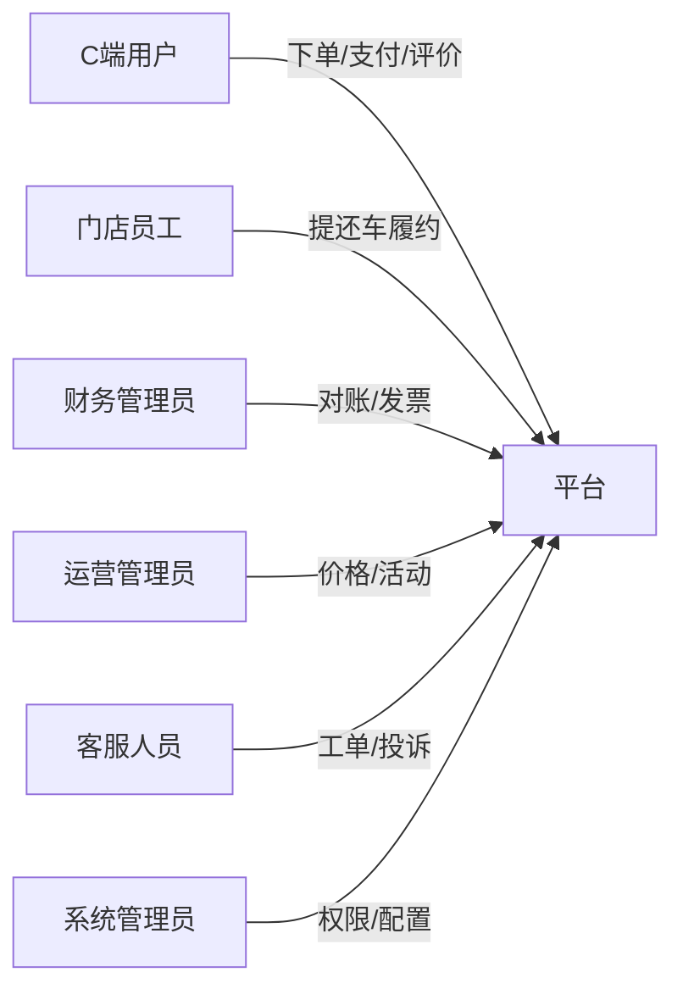
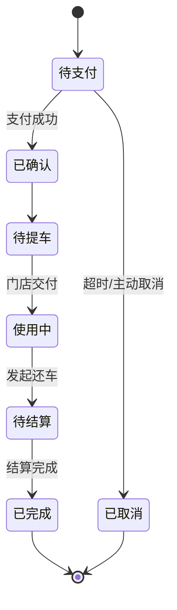
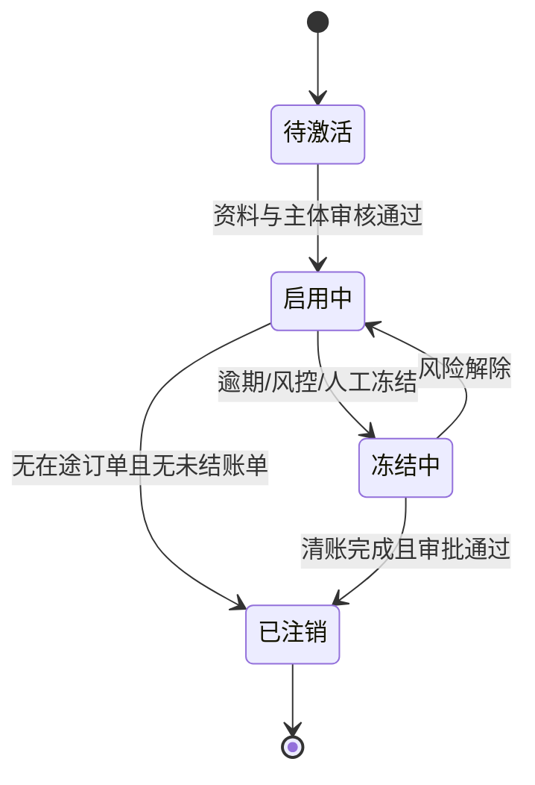
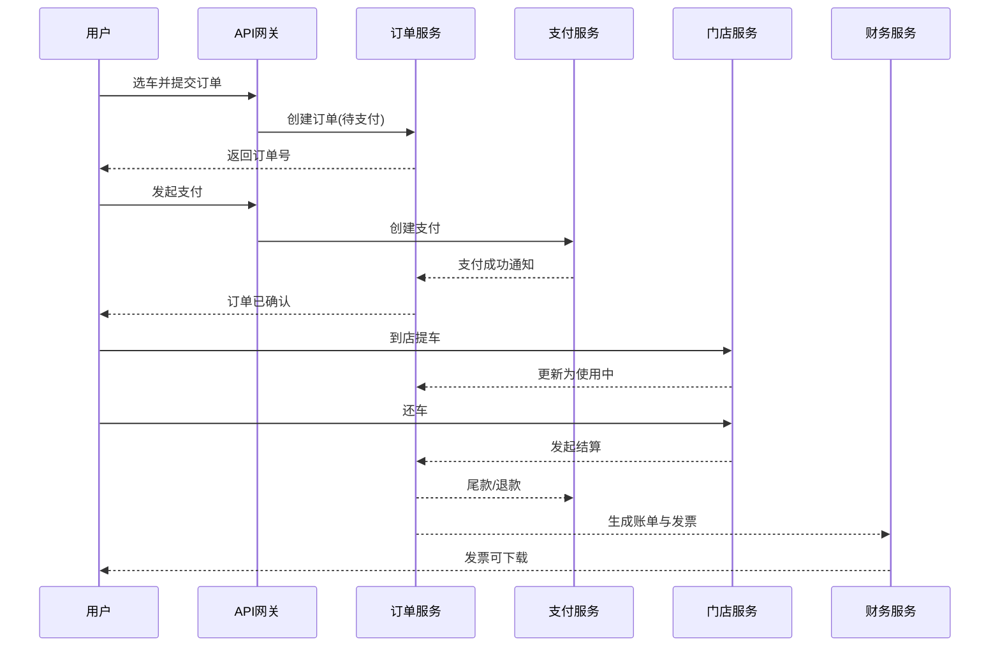
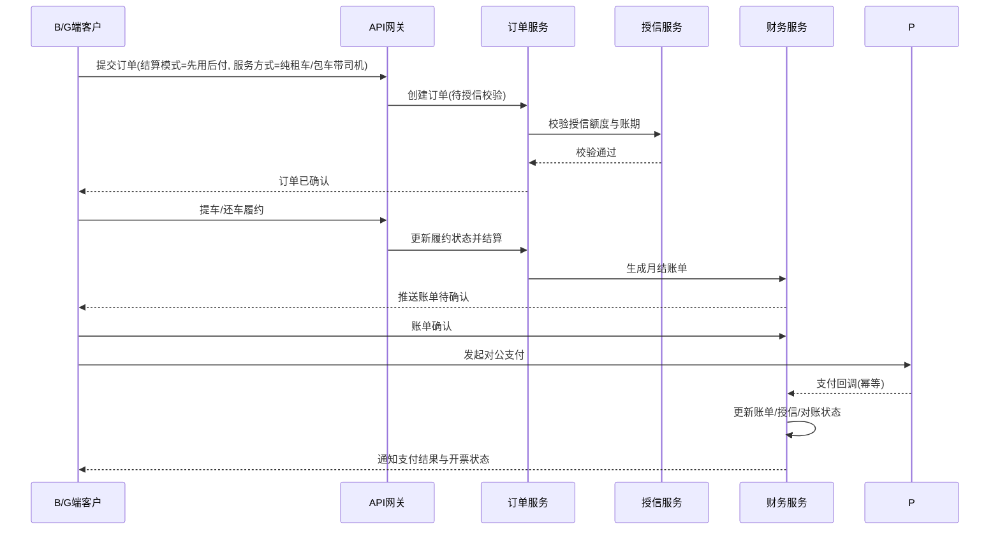

# 租车平台需求规格说明书（SRS）

版本：1.9  
日期：2026-06-01

## 1. 文档目的与范围

本文档定义租车平台的业务需求、功能需求、非功能需求、业务规则与验收标准，作为产品、研发、测试、运营一致执行的需求基线。

### 1.1 产品目标

- 为 C 端用户提供完整的租车交易闭环：选车 -> 下单 -> 支付 -> 提车 -> 还车 -> 结算 -> 开票。
- 为 B 端企业客户与 G 端政务客户提供“先用车后付费”账期结算能力。
- 为门店、财务、运营、客服提供统一管理后台。
- 提升车辆利用率、订单履约率与用户满意度。
- 支撑约 **200 台** 重资产车队的 **数字化下单、违章批量查询、账期对公勾稽、租期事故闭环与经营看板**（详见业务背景文档）。

### 1.2 客户背景与痛点（摘要）

> 完整说明见 [租车平台业务背景与客户痛点说明.md](./租车平台业务背景与客户痛点说明.md)

| 痛点 | 现状 | 平台目标 |
|---|---|---|
| 手工下单 | 电话/表格分散记录 | 统一订单状态机与库存占用 |
| 手工查违章 | 逐车登录 12123 | 批量违章任务 + 配额与成本台账 |
| 先开后票、对公打款 | 发票与银行流水难对齐订单 | 账单 + 回款识别码 + 流水匹配 |
| 缺乏精细化运营 | 无全局营收/成本视图 | 月/季/年看板与异常预警 |
| 租期事故 | 流程分散、与结算脱节 | 事故单状态机 + 费用入账 + 车辆停运 |
| 认证场景复杂 | B/G 代订车、资质、授信 | 分层认证模型（见需求补充说明书 §4） |

### 1.3 范围边界

**In Scope（一期）**
- 用户与认证、车辆与库存、订单与履约、支付与退款、发票与账单、门店作业、基础客服、基础运营分析。

**Out of Scope（二期及以后）**
- 智能推荐、复杂信用评分模型、多币种国际化、跨境税务适配。

---

## 2. 角色与权限

| 角色 | 说明 | 关键权限 |
|---|---|---|
| C端用户 | 租车用户 | 浏览车型、下单、支付、提还车确认、开票申请、工单提交 |
| B端客户 | 企业客户 | 企业账号下单、先用车后付、账单确认、对公支付 |
| G端客户 | 政务客户 | 政务账号下单、先用车后付、对账确认、集中结算 |
| 门店员工 | 门店作业人员 | 交付验车、还车验收、订单履约处理 |
| 财务管理员 | 财务人员 | 对账、退款审核、发票开具 |
| 运营管理员 | 运营人员 | 价格规则、活动配置、报表分析 |
| 系统管理员 | 平台管理员 | 用户角色、权限策略、安全策略、配置管理 |
| 客服人员 | 客诉处理人员 | 工单受理、投诉处理、赔付建议 |

---

## 3. 功能需求

## 3.1 用户与认证（FR-USER）

- FR-USER-001：支持手机号注册登录与验证码登录。
- FR-USER-002：支持第三方登录绑定（微信/支付宝）。
- FR-USER-003：支持实名信息提交与审核状态查询。
- FR-USER-004：支持驾驶证上传、有效期校验、到期提醒。
- FR-USER-005：支持账户冻结与黑名单标记。
- FR-USER-006：支持 B/G 端组织主体管理（企业/政府单位档案、统一社会信用代码、联系人信息）。
- FR-USER-007：支持 B/G 端成员管理（主账号、子账号、部门归属、岗位标识）。
- FR-USER-008：支持 B/G 端 RBAC 权限模型（角色模板 + 数据范围 + 操作权限）。
- FR-USER-009：支持 B/G 端审批流（成员开通、权限变更、账单确认、敏感操作审批）。
- FR-USER-010：支持 B/G 端账号生命周期（待激活、启用、冻结、注销）与全量审计。
- FR-USER-011：C 端注册登录强化（手机号唯一、第三方绑定/解绑、可选设备记录）。
- FR-USER-012：C 端实名认证细化（证件 OCR/人脸、审核状态与驳回原因）。
- FR-USER-013：C 端驾照认证细化（车型、有效期、到期提醒、过期禁止下单）。
- FR-USER-014：下单前用车资格聚合校验（实名+驾照+黑名单+组织账单逾期）。
- FR-USER-015：B 端企业主体资质审核（执照、信用代码、对公账户）与 `POSTPAID` 开通前置。
- FR-USER-016：B/G 代订车模型（下单人 vs 实际驾驶人，驾驶人须独立实名/驾照校验）。
- FR-USER-017：B/G 企业授信与合同管理（额度、账期、合同有效期、超额/逾期冻结）。
- FR-USER-018：B/G 多开票抬头库与税号校验（与发票模块共用）。
- FR-USER-019：后台账号 RBAC + 门店/区域数据范围。
- FR-USER-020：高风险操作 MFA（退款、授信、冲销、权限变更）。
- FR-USER-021：认证资料脱敏展示与导出审计。

## 3.2 车辆与库存（FR-VEH）

- FR-VEH-001：支持按城市/门店/车型/时间窗口检索可租车辆。
- FR-VEH-002：支持车辆状态流转（可用、已占用、已租、维修、报废）。
- FR-VEH-003：支持车辆图片、配置、价格、库存展示。
- FR-VEH-004：支持 GPS 轨迹采集与查询（按权限）。

## 3.3 订单与履约（FR-ORD）

- FR-ORD-001：支持订单创建、修改、取消。
- FR-ORD-002：支持提车门店与还车门店配置（同店/异店）。
- FR-ORD-003：支持提车验车清单、图片留存、电子签署。
- FR-ORD-004：支持还车验收、损伤记录、责任备注。
- FR-ORD-005：支持订单状态全生命周期追踪。
- FR-ORD-006：支持订单结算模式区分（即时支付/先用后付）。
- FR-ORD-007：支持 B/G 端服务方式区分（纯租车 `SELF_DRIVE` / 包车带司机 `WITH_DRIVER`）。
- FR-ORD-008：支持租期 **使用中** 事故上报（时间、地点、类型、现场照片、报案信息）。
- FR-ORD-009：支持事故单状态机、处理人指派、附件与工单/订单/车辆关联。
- FR-ORD-010：支持事故导致的暂停计费、租期延长（审批）、事故费用项计入待结算账单。
- FR-ORD-011：支持保险理赔信息登记与事故材料包导出（一期半自动）。
- FR-ORD-012：支持事故统计看板与全量状态变更审计。

## 3.4 支付与退款（FR-PAY）

- FR-PAY-001：支持租金、押金、尾款支付。
- FR-PAY-002：支持退款申请、审核、原路退回。
- FR-PAY-003：支持支付渠道回调幂等处理。
- FR-PAY-004：支持钱包余额查询（可选）。
- FR-PAY-005：支持 B 端/G 端账期结算（先用车后付）与账单支付。
- FR-PAY-006：支持 B/G 端对公支付回调、失败重试、部分支付与支付后状态追踪。
- FR-PAY-007：支持对公支付失败自动重试策略（重试计划、终止条件、死信转人工）。

## 3.5 财务与发票（FR-FIN）

- FR-FIN-001：支持账单生成与账单明细查询。
- FR-FIN-002：支持电子发票申请、开具、下载。
- FR-FIN-003：支持个人/企业抬头管理与税号校验。
- FR-FIN-004：支持按日/周/月财务对账报表。
- FR-FIN-005：支持企业/政务月结账单生成、账单确认与结清跟踪。
- FR-FIN-006：支持账单确认后流程编排（放款核销、额度释放、对账归档、开票就绪通知）。
- FR-FIN-007：支持对公回款 **唯一识别码** 生成及付款指引（发票备注/转账附言模板）。
- FR-FIN-008：支持银行流水导入/回调与账单自动匹配（识别码优先，支持部分/多笔合并支付）。
- FR-FIN-009：支持未匹配流水、账龄（0-30/31-60/61-90/90+）看板与导出。

## 3.6 客服与投诉（FR-CS）

- FR-CS-001：支持工单创建、分派、处理、关闭。
- FR-CS-002：支持投诉仲裁与赔付记录。
- FR-CS-003：支持工单关联订单、支付、退款记录。

## 3.7 运营管理（FR-OPS）

- FR-OPS-001：支持价格规则配置（节假日、门店、车型维度）。
- FR-OPS-002：支持优惠券与活动投放。
- FR-OPS-003：支持出租率、收入、活跃度看板。
- FR-OPS-004：支持营收看板（月/季/年：租金、司机费、违约金等）。
- FR-OPS-005：支持车辆利用率统计（按门店/车型/时间维度）。
- FR-OPS-006：支持 B/G 客户贡献统计（订单量、应收、实收基础口径）。
- FR-OPS-007：支持成本看板（维保、违章查询、事故赔付、第三方接口费等）。
- FR-OPS-008：支持司机管理（包车场景：在岗、排班、服务单量、异常）。
- FR-OPS-009：支持订单异常预警（逾期、事故待结、对公支付失败等）。

## 3.8 扩展运营能力（FR-EXT）

- FR-EXT-001：支持批量违章查询（按车辆列表批量提交、异步回填结果）。
- FR-EXT-002：支持违章查询配额控制（默认每月2次，支持后台配置）。
- FR-EXT-003：支持违章查询成本统计（按“单车单次”记录费用与汇总）。
- FR-EXT-004：支持 GPS 厂商 API 对接（实时位置、历史轨迹、在线状态）；备选供应商：**图强（途强物联）**、**承载视频物联**，按 `gps_provider` 分车路由。
- FR-EXT-005：支持小程序约车起点位置输入与定位选点。
- FR-EXT-006：支持地图授权策略配置（地图厂商直连模式 / GPS厂商透传模式）。
- FR-EXT-007：支持违章批量任务失败重试、异常告警与审计追踪。
- FR-EXT-008：支持第三方接口调用熔断与降级（违章、GPS、地理编码）。

---

## 4. 核心业务规则

- BR-001：用户未实名或驾照无效，不允许下单。
- BR-002：同一车辆同一时间窗口只能被一个有效订单占用。
- BR-003：`PREPAID` 订单支付成功前，订单状态不得进入“已确认”。
- BR-004：支付回调必须幂等；重复回调不可重复扣款。
- BR-005：还车后需先完成结算，再允许进入“已完成”。
- BR-006：发票开具基于已结算账单，不允许对未结算订单开票。
- BR-007：高风险操作（退款审批、权限变更）必须二次认证并审计。
- BR-008：C 端订单默认即时支付后确认；B/G 端订单在授信有效时允许“先确认后结算”。
- BR-009：B/G 端账期订单必须在约定账期内完成账单结清，逾期触发风控与下单限制。
- BR-010：B/G 端仅主账号或被授权子账号可发起先用后付下单，且必须在权限范围内操作。
- BR-011：B/G 端成员权限变更、账期确认、授信调整必须经过审批流并保留审计证据。
- BR-012：B/G 端账号冻结后，组织下所有子账号自动禁用下单与账单确认能力。
- BR-013：`POSTPAID` 订单在授信通过后可进入“已确认”，无需现付成功事件。
- BR-014：B/G 端审批必须职责分离，申请人与审批人不得为同一成员。
- BR-015：组织进入“冻结/注销”前必须满足：无进行中订单、无未结清账单。
- BR-016：B/G 端 `WITH_DRIVER` 订单在进入“待提车/待出车”前必须完成司机分配与排班校验。
- BR-017：B/G 端 `SELF_DRIVE` 订单默认不分配司机，司机服务费为0。
- BR-018：账单确认后状态必须从 `PENDING_CONFIRM` 进入 `PENDING_PAYMENT`，未确认不得发起对公支付。
- BR-019：对公支付回调必须幂等；支付成功后需同步更新账单状态、关联订单状态、授信额度与对账快照。
- BR-020：账单支持部分支付（`PARTIALLY_PAID`）；仅在实付金额达到应付总额后进入 `PAID` 并触发开票就绪。
- BR-021：对公支付失败后自动重试最多3次，重试间隔固定为 `5m -> 15m -> 30m`，超过次数进入死信队列并触发财务工单。
- BR-022：每次重试前必须重新校验账单状态、账期有效性与支付幂等键；若账单已结清或已关闭则终止重试。
- BR-023：违章查询按“配额优先”策略执行；当月剩余额度不足时，默认拒绝查询并返回配额不足错误。
- BR-024：违章批量查询以“车辆”为计费单位；默认供应商为数脉（`SHUMAI`），`unit_cost` 默认 **0.06 元/次**，须记录车辆数、单价、总费用与调用来源。
- BR-025：同一车辆在同一自然日内可配置去重策略（可选），避免重复计费。
- BR-026：GPS数据仅用于车辆运营与风控场景，轨迹数据需按最小必要原则存储并设置保留周期。
- BR-027：地图能力分场景管理：约车起点输入场景与GPS轨迹展示场景分别核算授权策略与成本。
- BR-028：地图商用授权状态未确认前，系统默认开启低风险模式（仅地理编码与定位，不启用高风险地图能力）。
- BR-029：所有第三方接口调用必须记录 `request_id`、`provider`、`endpoint`、`status`、`cost`，满足审计追溯。
- BR-030：车辆处于 `ACCIDENT_HOLD`（事故停运）时，禁止参与可租资源占用。
- BR-031：存在未 `RESOLVED` 的主事故单时，订单不得进入 **已完成**；可进入待结算但须标记 `incident_pending`。
- BR-032：事故相关费用入账前须由运营或财务确认；事故上报人不可单独确认金额。
- BR-033：涉及人伤的事故必须创建高优先级工单并通知客服。
- BR-034：同一订单仅允许一条处于处理中的主事故单（`UNDER_REVIEW` / `INSURANCE_PROCESSING`）。
- BR-035：C 端下单须写入用车资格校验快照 ID，便于事后追溯。
- BR-036：`POSTPAID` 订单创建须校验组织授信并记录 `credit_limit`、`used_amount`、`contract_id` 快照。
- BR-037：B/G 代订车场景下，实际驾驶人未通过驾照校验则订单不得进入「已确认」。
- BR-038：对公流水匹配须优先使用回款识别码；无识别码时进入人工认领队列并保留审计。

---

## 5. 非功能需求（NFR）

> **技术栈与 NFR 映射**：见 [租车平台技术栈选型说明.md](./租车平台技术栈选型说明.md)（后端 **Java 17+ / Spring Boot 3**，数据 PostgreSQL + Redis，前端 React + 微信小程序，认证 Spring Security + JWT，部署 Docker/K8s）。

## 5.1 性能

- NFR-PERF-001：核心 API 响应时间 P95 < 200ms。
- NFR-PERF-002：首屏加载时间 < 3s。
- NFR-PERF-003：订单处理能力 >= 1000 单/分钟。

## 5.2 可靠性

- NFR-REL-001：系统可用性 >= 99.9%。
- NFR-REL-002：RTO < 15 分钟，RPO < 5 分钟。
- NFR-REL-003：核心链路错误率 < 0.1%。
- NFR-REL-004：对公支付失败自动重试任务执行成功率 >= 99%，死信转人工延迟 <= 10 分钟。

## 5.3 安全与合规

- NFR-SEC-001：传输层 HTTPS/TLS1.3，敏感数据存储加密。
- NFR-SEC-002：RBAC 权限控制 + 审计日志。
- NFR-SEC-003：支持 MFA（高风险操作）。
- NFR-SEC-004：满足等保三级与支付合规要求。

## 5.4 可维护性

- NFR-MNT-001：自动化测试覆盖率 >= 80%。
- NFR-MNT-002：核心服务具备日志、指标、链路追踪。
- NFR-MNT-003：CI/CD 全流程自动化（构建、测试、部署）。

---

## 6. 核心用户流程

---

## 7. 验收标准

- AC-001：完成“下单-支付-提车-还车-结算-开票”主流程端到端可用。
- AC-002：订单、支付、退款数据可对账，差异可追踪。
- AC-003：同车同时间窗口无超卖。
- AC-004：关键操作均可审计追溯。
- AC-005：性能与可用性满足 NFR 基线。
- AC-006：B/G 端“先用车后付”链路可用，账单可按账期完成对账与结清。
- AC-007：B/G 端组织、成员、角色、审批链路可用，关键操作100%可审计追溯。
- AC-008：B/G 端审批满足职责分离规则，禁止自审；组织冻结/注销满足前置条件校验。
- AC-009：B/G 端两种服务方式（纯租车/包车带司机）可独立下单、履约、结算并可追溯。
- AC-010：账单确认后至对公支付完成流程可端到端跑通，支持部分支付、支付失败重试与支付后对账闭环。
- AC-011：支付失败自动重试策略按 `5m/15m/30m` 生效，超限自动入死信并生成财务工单，过程可审计。
- AC-012：批量违章查询端到端可用，支持批量提交、异步回填、失败重试与明细导出。
- AC-013：违章查询配额控制生效，默认每月2次且支持后台配置，超额策略可切换（拒绝/审批/付费）。
- AC-014：违章查询成本统计可追溯至单次任务与单车维度，月度统计与账务核对一致。
- AC-015：GPS实时定位与历史轨迹可用，轨迹数据延迟与精度满足厂商SLA。
- AC-016：地图授权策略可配置且可审计，未授权高风险能力在生产环境不可启用。
- AC-017：使用中订单可创建事故单，非使用中订单拒绝且错误码明确。
- AC-018：事故单状态流转、关联订单/车辆/工单可端到端追溯。
- AC-019：事故费用确认后计入账单，还车验收可引用事故结论且无重复计费。
- AC-020：`ACCIDENT_HOLD` 车辆不可被新订单时间窗占用。
- AC-021：C 端未实名或驾照过期用户无法下单。
- AC-022：B/G 代订车订单可区分下单人与实际驾驶人及各自认证状态。
- AC-023：企业资质非 `ACTIVE` 时不可创建 `POSTPAID` 订单。
- AC-024：开票抬头税号校验失败时不可开具对应企业发票。
- AC-025：后台高风险操作触发 MFA 且审计完整。
- AC-026：带回款识别码的对公流水可自动匹配账单，部分支付状态正确。

---

## 8. 版本规划

- 一期（MVP，3-4个月）：用户、车辆、订单、支付、门店履约、基础财务与客服。
- 二期（2-3个月）：运营分析深化、发票与对账增强、风控增强。
- 三期（2-3个月）：智能推荐、精细化营销、国际化支持。

---

## 9. 需求优先级（P0/P1/P2）

| 需求ID | 需求名称 | 优先级 | 版本 | 说明 |
|---|---|---|---|---|
| FR-USER-001 | 手机号注册登录 | P0 | v1.0 | 主流程入口能力 |
| FR-USER-003 | 实名认证 | P0 | v1.0 | 下单前置条件 |
| FR-USER-004 | 驾照校验 | P0 | v1.0 | 下单前置条件 |
| FR-USER-006 | B/G主体管理 | P0 | v1.2 | 企业/政府组织基础能力 |
| FR-USER-007 | B/G成员管理 | P0 | v1.2 | 主子账号治理能力 |
| FR-USER-008 | B/G权限模型 | P0 | v1.2 | 权限边界与合规能力 |
| FR-USER-009 | B/G审批流程 | P1 | v1.2 | 风控与管理能力 |
| FR-USER-010 | B/G账号生命周期 | P1 | v1.2 | 账号安全治理能力 |
| FR-VEH-001 | 车辆可用性检索 | P0 | v1.0 | 下单前置能力 |
| FR-VEH-002 | 车辆状态流转 | P0 | v1.0 | 履约核心 |
| FR-ORD-001 | 订单创建/取消 | P0 | v1.0 | 交易核心 |
| FR-ORD-003 | 提车验车 | P0 | v1.0 | 履约核心 |
| FR-ORD-004 | 还车验收 | P0 | v1.0 | 结算前置 |
| FR-ORD-006 | 结算模式区分 | P0 | v1.1 | 支持先用后付 |
| FR-ORD-007 | 服务方式区分 | P0 | v1.5 | 支持纯租车与包车带司机 |
| FR-PAY-001 | 支付能力 | P0 | v1.0 | 交易核心 |
| FR-PAY-003 | 支付回调幂等 | P0 | v1.0 | 一致性核心 |
| FR-PAY-005 | 账期结算支付 | P0 | v1.1 | B/G端核心交易能力 |
| FR-PAY-006 | 对公支付后处理 | P0 | v1.6 | 回调幂等与支付后闭环 |
| FR-PAY-007 | 对公支付失败重试 | P0 | v1.7 | 自动重试与死信转人工 |
| FR-EXT-001 | 批量违章查询 | P0 | v1.8 | 运营增值核心能力 |
| FR-EXT-002 | 违章查询配额控制 | P0 | v1.8 | 成本可控核心能力 |
| FR-EXT-003 | 违章查询成本统计 | P1 | v1.8 | 费用透明与对账能力 |
| FR-EXT-004 | GPS厂商API对接 | P0 | v1.8 | 车辆定位核心能力 |
| FR-EXT-005 | 起点位置输入/定位选点 | P0 | v1.8 | 小程序约车基础能力 |
| FR-EXT-006 | 地图授权策略配置 | P0 | v1.8 | 合规与成本控制能力 |
| FR-EXT-007 | 违章任务重试与审计 | P1 | v1.8 | 稳定性与可追溯能力 |
| FR-EXT-008 | 第三方接口熔断降级 | P1 | v1.8 | 稳定性保障能力 |
| FR-FIN-001 | 账单生成 | P0 | v1.0 | 结算闭环 |
| FR-FIN-005 | 月结账单管理 | P1 | v1.1 | 对公结算闭环 |
| FR-FIN-006 | 账单确认后编排 | P1 | v1.6 | 对账与开票衔接闭环 |
| FR-FIN-002 | 电子发票 | P1 | v1.0 | 财务闭环 |
| FR-CS-001 | 工单处理 | P1 | v1.0 | 售后必要 |
| FR-OPS-001 | 价格规则配置 | P1 | v1.0 | 运营必要 |
| FR-OPS-002 | 优惠券活动 | P2 | v1.1 | 增长能力 |
| FR-VEH-004 | GPS轨迹查询 | P2 | v1.1 | 二期增强 |
| FR-ORD-008 | 租期事故上报 | P0 | v1.9 | 客户补充核心 |
| FR-ORD-009 | 事故单状态机 | P0 | v1.9 | 协同与审计 |
| FR-ORD-010 | 事故计费影响 | P1 | v1.9 | 与结算衔接 |
| FR-ORD-011 | 保险理赔登记 | P1 | v1.9 | 一期半自动 |
| FR-ORD-012 | 事故统计 | P1 | v1.9 | 运营分析 |
| FR-USER-011~014 | C端认证细化 | P0 | v1.9 | 下单资格闭环 |
| FR-USER-015~018 | B/G认证与授信 | P0 | v1.9 | 先开后票前置 |
| FR-USER-019~021 | 后台认证安全 | P1 | v1.9 | 合规与审计 |
| FR-FIN-007 | 回款识别码 | P0 | v1.9 | 对公勾稽核心 |
| FR-FIN-008 | 银行流水匹配 | P0 | v1.9 | 对公勾稽核心 |
| FR-FIN-009 | 账龄与未匹配流水 | P1 | v1.9 | 财务运营 |
| FR-OPS-004~009 | 精细化运营看板 | P1 | v1.9 | 成本与增长数据 |

---

## 10. 需求版本追踪矩阵（Requirement Traceability）

| 需求ID | 对应业务规则 | 对应验收标准 | 对应模块 |
|---|---|---|---|
| FR-USER-003 | BR-001 | AC-001 | User/Auth |
| FR-USER-004 | BR-001 | AC-001 | User/Auth |
| FR-USER-006 | BR-010 | AC-007 | User/Auth |
| FR-USER-007 | BR-010, BR-012 | AC-007 | User/Auth |
| FR-USER-008 | BR-010, BR-011 | AC-007 | User/Auth |
| FR-USER-009 | BR-011 | AC-007 | User/Auth |
| FR-USER-010 | BR-012 | AC-004, AC-007 | User/Auth |
| FR-USER-009 | BR-014 | AC-008 | User/Auth |
| FR-USER-010 | BR-015 | AC-008 | User/Auth |
| FR-VEH-001 | BR-002 | AC-003 | Vehicle/Order |
| FR-ORD-001 | BR-002, BR-003 | AC-001, AC-003 | Order |
| FR-ORD-007 | BR-016, BR-017 | AC-009 | Order/Store |
| FR-PAY-001 | BR-003, BR-004 | AC-001, AC-002 | Payment/Order |
| FR-PAY-003 | BR-004 | AC-002 | Payment |
| FR-ORD-004 | BR-005 | AC-001 | Order/Store |
| FR-ORD-006 | BR-008 | AC-006 | Order/Payment |
| FR-FIN-001 | BR-005, BR-006 | AC-001, AC-002 | Finance |
| FR-PAY-005 | BR-008, BR-009 | AC-002, AC-006 | Payment/Finance |
| FR-PAY-006 | BR-018, BR-019, BR-020 | AC-002, AC-010 | Payment/Finance |
| FR-PAY-007 | BR-021, BR-022 | AC-011 | Payment/Finance |
| FR-EXT-001 | BR-023, BR-024, BR-029 | AC-012, AC-014 | Operation/Vehicle |
| FR-EXT-002 | BR-023 | AC-013 | Operation |
| FR-EXT-003 | BR-024, BR-029 | AC-014 | Operation/Finance |
| FR-EXT-004 | BR-026, BR-029 | AC-015 | Vehicle/Integration |
| FR-EXT-005 | BR-027, BR-028 | AC-016 | Client/Map |
| FR-EXT-006 | BR-027, BR-028 | AC-016 | Platform/Security |
| FR-EXT-007 | BR-029 | AC-012 | Operation/Integration |
| FR-EXT-008 | BR-029 | AC-012, AC-015 | Gateway/Integration |
| FR-FIN-005 | BR-006, BR-009 | AC-002, AC-006 | Finance |
| FR-FIN-006 | BR-019, BR-020 | AC-002, AC-010 | Finance |
| FR-FIN-002 | BR-006 | AC-001, AC-002 | Finance |
| FR-CS-001 | BR-007 | AC-004 | Customer |
| FR-ORD-008~012 | BR-030~BR-034 | AC-017~AC-020 | Order/Store/CS |
| FR-USER-011~014 | BR-001, BR-035 | AC-021 | User/Auth |
| FR-USER-015~018 | BR-036, BR-037 | AC-022, AC-023, AC-024 | User/Finance |
| FR-USER-020 | BR-007 | AC-025 | Auth/Admin |
| FR-FIN-007~008 | BR-038, BR-019, BR-020 | AC-026, AC-010 | Finance/Payment |
| FR-FIN-009 | BR-009 | AC-026 | Finance |
| FR-OPS-004~009 | — | AC-002（扩展） | Operation |

---

## 11. 变更记录

| 版本 | 日期 | 变更内容 | 责任人 |
|---|---|---|---|
| v1.0 | 2026-05-13 | 初版需求文档拆分完成 | jerry |
| v1.1 | 2026-05-13 | 增加优先级与需求追踪矩阵 | jerry |
| v1.2 | 2026-05-14 | 新增B/G端先用车后付场景，补充需求规则与验收项 | jerry |
| v1.3 | 2026-05-14 | 优化企业/政府用户管理需求（组织、成员、权限、审批） | jerry |
| v1.4 | 2026-05-14 | 闭环B/G生命周期缺口（规则冲突、职责分离、冻结注销前置） | jerry |
| v1.5 | 2026-05-14 | 新增B/G端两种服务方式（纯租车/包车带司机）需求与规则 | jerry |
| v1.6 | 2026-05-14 | 完善账单确认与对公支付后流程（回调幂等、部分支付、对账开票衔接） | jerry |
| v1.7 | 2026-05-14 | 明确对公支付失败自动重试策略（次数、间隔、死信） | jerry |
| v1.8 | 2026-05-18 | 新增批量违章、GPS接入、地图授权与第三方成本控制需求 | codex |
| v1.9 | 2026-06-01 | 补充客户痛点背景、租期事故、用户认证细化、银行流水勾稽、精细化运营看板 | — |
