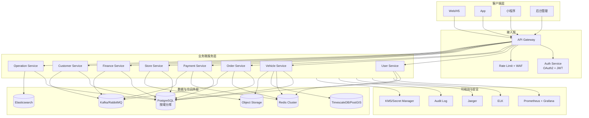
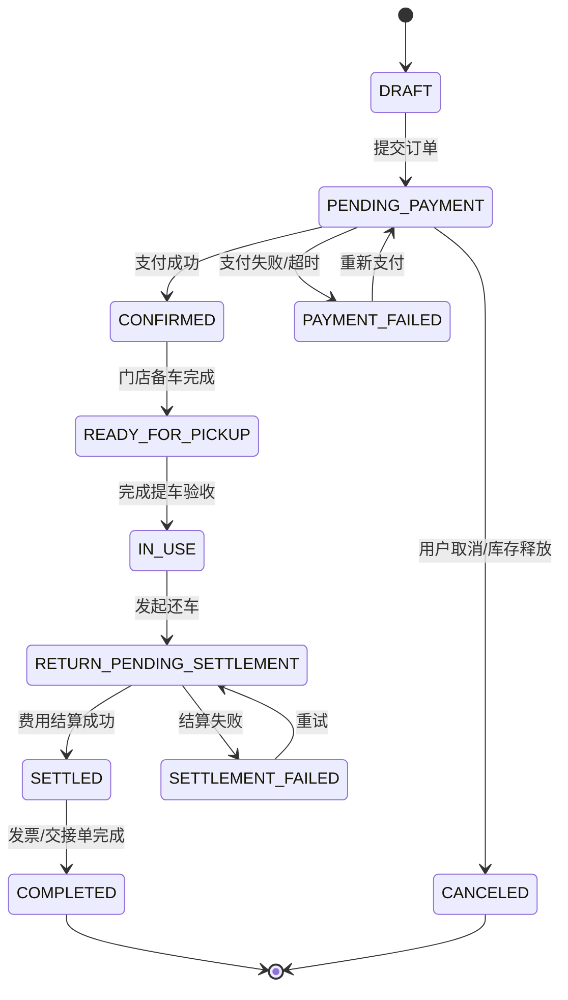
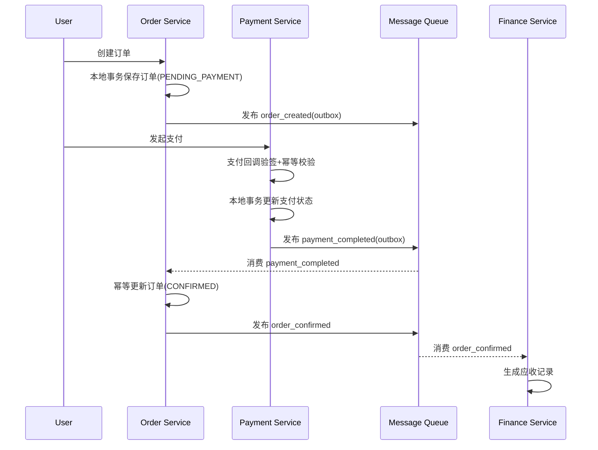
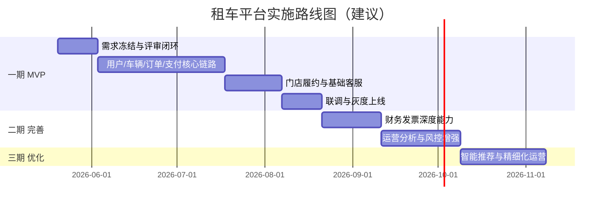

# 租车平台需求评审与设计完善（评审版）

> 基于《租车平台需求梳理》《租车平台系统架构设计》进行对齐评审、缺口补充与落地化设计。

## 1. 评审结论（TL;DR）

- 两份文档总体方向一致：均采用微服务、前后端分离、事件驱动和云原生部署。
- 当前文档可支持“方案评审”，但尚不足以直接进入“高质量开发排期”。
- 主要缺口集中在：
  - 业务规则不够可执行（状态机、幂等、超时、冲突策略不足）
  - 跨服务一致性设计不足（订单-支付-车辆-财务）
  - B/G 端“先用车后付”场景未在需求与架构中形成统一定义
  - B/G 端用户管理能力未闭环（组织、成员、审批、审计）
  - 数据模型关键字段缺失（审计字段、唯一约束、乐观锁、软删）
  - 非功能指标未拆解到服务级SLO与容量基线
  - 安全合规项未形成可验收清单（MFA触发规则、密钥轮换、PII分级）

---

## 2. 需求评审（问题清单 + 风险等级）

### 2.1 高风险（上线前必须闭环）

1. **订单状态定义不闭环**
   - 现状：仅给出少量状态，缺少“支付中、支付失败、已取消、待结算、结算失败、争议中”等。
   - 风险：状态跳转歧义，导致脏数据和退款纠纷。
   - 建议：建立订单状态机 + 可达性校验 + 事件补偿。

2. **支付与订单一致性策略未定义**
   - 现状：文档提到事件驱动，但未定义 Outbox / 幂等键 / 重试死信。
   - 风险：重复扣款、订单未确认、账务不一致。
   - 建议：采用“本地事务 + Outbox + 消费幂等”标准方案。

3. **库存并发控制不足**
   - 现状：订单创建与车辆占用流程未明确定义并发锁。
   - 风险：超卖（同一车辆被重复预订）。
   - 建议：Vehicle Availability Slot + 乐观锁版本号 + 过期释放任务。

4. **GPS/轨迹与隐私合规边界不清**
   - 现状：有轨迹与行为监控需求，但缺少最小化采集策略与保留周期。
   - 风险：合规风险（隐私投诉、监管处罚）。
   - 建议：按数据分级定义采集频率、用途、保留期与脱敏策略。

### 2.2 中风险（迭代初期必须补齐）

1. 门店异地还车调度规则缺失（跨店费用、库存回补策略）
2. 违章费/超时费结算时点不清（实时估算 vs 最终清算）
3. 发票业务规则不完整（蓝票/红冲、抬头校验、税率策略）
4. 风险管理与客服仲裁缺少统一“工单-订单-支付”关联模型
5. 多端（APP/H5/小程序）能力边界和一致性策略未定义
6. B/G 端先用后付账期策略缺少授信、逾期、限流规则
7. B/G 端组织成员权限模型缺少数据范围与审批留痕约束
8. B/G 端服务方式缺少履约差异定义（纯租车 vs 包车带司机）
9. 账单确认后流程未闭环（部分支付、失败重试、授信释放、开票就绪）
10. 对公支付失败重试策略参数未固化（重试次数、间隔、死信阈值）

### 2.3 低风险（可在二期完善）

1. 推荐/营销算法能力描述较宏观，缺乏MVP定义
2. 多云与跨地域容灾目标未与成本模型联动
3. 管理后台多角色审计视图未细化

---

## 3. 对齐后的目标范围（MVP 建议）

### 3.1 MVP 必做能力

- 用户注册登录、实名与驾照审核
- B/G 端组织管理、成员管理、角色权限与审批管理
- 车辆检索、可用性校验、订单创建/取消
- B/G 端两种服务方式（纯租车、包车带司机）下单与履约
- 支付（下单支付、尾款/退款）
- B/G 端先用车后付（授信校验、账期账单、对公结算）
- 提车、还车、费用结算、电子发票
- 门店作业台（交付/验车/交接单）
- 基础客服工单
- 核心监控与审计日志

### 3.2 延后到二期能力

- 高级营销与推荐
- 用户信用评分深度模型
- 高级运营分析（LTV/CAC 归因）
- 全球化与多币种

---

## 4. 完善后的架构设计

### 4.1 总体架构图（优化版）



### 4.2 关键状态机（订单）



### 4.3 跨服务一致性（支付确认）



---

## 5. 完善后的需求与设计对照矩阵

| 需求域 | 关键需求 | 设计落点 | 验收标准 |
|---|---|---|---|
| 用户与认证 | 注册登录、实名、驾照审核 | User Service + Auth Service + Redis Session | 登录成功率>99.9%，证件审核全链路可追踪 |
| B/G用户管理 | 组织、成员、角色、审批、冻结联动 | User Service + RBAC + Audit Log | 越权率=0，审批与变更100%可追溯 |
| 车辆与库存 | 可用性查询、状态流转、GPS | Vehicle Service + TimescaleDB/PostGIS | 无超卖，状态流转有审计 |
| 订单履约 | 创建、取消、提还车、延期、司机调度 | Order Service + Store Service | 订单状态机无非法跳转 |
| 支付与退款 | 预授权/支付/退款 | Payment Service + Outbox | 重复回调不重复扣款 |
| B/G账期结算 | 先用后付、账单聚合、逾期管控、支付后处理 | Order + Finance + Payment | 账期内结清、逾期自动限制下单 |
| 财务发票 | 账单、发票、对账 | Finance Service | 订单-支付-发票可对账闭环 |
| 客服与仲裁 | 工单、投诉、赔付 | Customer Service | 工单可关联订单与支付单 |
| 可观测与安全 | 审计、告警、追踪 | ELK + Prometheus + Jaeger + WAF | 关键操作100%可审计 |

---

## 6. 核心业务流程伪代码（可直接转实现）

### 6.1 下单与车辆占用

```pseudo
FUNCTION createOrder(userId, vehicleTypeId, pickupTime, returnTime, pickupStore, returnStore):
  VALIDATE user实名认证状态 == 通过
  VALIDATE 驾照状态 == 有效
  VALIDATE 时间窗口合法(pickupTime < returnTime)

  candidateVehicles = queryAvailableVehicles(vehicleTypeId, pickupStore, pickupTime, returnTime)
  IF candidateVehicles is empty:
    RETURN error("无可用车辆")

  selectedVehicle = chooseBestVehicle(candidateVehicles)

  BEGIN TRANSACTION
    success = reserveVehicleSlot(selectedVehicle.id, pickupTime, returnTime, versionCheck=true)
    IF !success:
      ROLLBACK
      RETURN error("库存冲突，请重试")

    orderId = insertOrder(
      userId,
      selectedVehicle.id,
      status=PENDING_PAYMENT,
      price=calculateEstimatedPrice(...)
    )

    insertOutboxEvent("order_created", orderId, idempotencyKey)
  COMMIT

  RETURN success(orderId)
```

### 6.6 B/G端服务方式分流（纯租车/包车带司机）

```pseudo
FUNCTION createBgOrderWithServiceMode(accountId, orderDraft):
  VALIDATE orderDraft.serviceMode IN [SELF_DRIVE, WITH_DRIVER]

  IF orderDraft.serviceMode == WITH_DRIVER:
    driver = dispatchAvailableDriver(orderDraft.pickupStore, orderDraft.pickupTime, orderDraft.returnTime)
    IF driver is null:
      RETURN error("当前时段无可用司机")
    orderDraft.driverId = driver.id
    orderDraft.chauffeurFee = calcChauffeurFee(orderDraft)
  ELSE:
    orderDraft.driverId = null
    orderDraft.chauffeurFee = 0

  orderId = createPostpaidOrder(accountId, orderDraft)
  RETURN success(orderId)
```

### 6.2 支付回调与订单确认

```pseudo
FUNCTION handlePaymentCallback(callbackPayload):
  VERIFY signature(callbackPayload)
  idempotencyKey = callbackPayload.transactionId

  IF existsProcessedCallback(idempotencyKey):
    RETURN success("already processed")

  BEGIN TRANSACTION
    payment = upsertPaymentRecord(callbackPayload, idempotencyKey)
    IF payment.status == SUCCESS:
      insertOutboxEvent("payment_completed", payment.orderId, idempotencyKey)
    ELSE:
      insertOutboxEvent("payment_failed", payment.orderId, idempotencyKey)
  COMMIT

  RETURN success()

CONSUMER onPaymentCompleted(event):
  IF isConsumed(event.idempotencyKey):
    ACK and RETURN

  BEGIN TRANSACTION
    order = getOrder(event.orderId)
    IF order.status IN [PENDING_PAYMENT, PAYMENT_FAILED]:
      updateOrderStatus(order.id, CONFIRMED)
      insertOutboxEvent("order_confirmed", order.id, event.idempotencyKey)
    markConsumed(event.idempotencyKey)
  COMMIT
```

### 6.3 还车结算

```pseudo
FUNCTION settleReturn(orderId, returnContext):
  order = getOrder(orderId)
  VALIDATE order.status == IN_USE

  fees = {
    rentalFee: calcBaseRental(order),
    overtimeFee: calcOvertime(order, returnContext.actualReturnTime),
    mileageFee: calcMileage(returnContext.mileage),
    violationFee: estimateViolation(order),
    damageFee: assessDamage(returnContext.inspectionPhotos)
  }

  total = sum(fees)
  paid = queryPaidAmount(orderId)
  balance = total - paid

  BEGIN TRANSACTION
    saveSettlement(orderId, fees, total, balance)
    IF balance > 0:
      setOrderStatus(orderId, RETURN_PENDING_SETTLEMENT)
      createReceivable(orderId, balance)
    ELSE IF balance < 0:
      createRefund(orderId, abs(balance))
      setOrderStatus(orderId, SETTLED)
    ELSE:
      setOrderStatus(orderId, SETTLED)

    insertOutboxEvent("order_settled", orderId, idempotencyKey)
  COMMIT

  RETURN settlementSummary(orderId)
```

### 6.4 B/G端先用后付（月结）流程

```pseudo
FUNCTION createPostpaidOrder(accountId, orderDraft):
  credit = queryCreditLine(accountId)
  IF credit.status != ACTIVE:
    RETURN error("授信不可用")

  estimatedCost = calculateEstimatedPrice(orderDraft)
  IF credit.availableAmount < estimatedCost:
    RETURN error("授信额度不足")

  orderId = createOrder(orderDraft, settlementMode=POSTPAID, status=CONFIRMED)
  freezeCredit(accountId, estimatedCost)
  RETURN success(orderId)

FUNCTION settlePostpaidBill(accountId, billingPeriod):
  orders = queryPostpaidOrders(accountId, billingPeriod, status IN [SETTLED, COMPLETED])
  bill = aggregateBill(accountId, billingPeriod, orders)
  pushBillForConfirmation(bill)

  IF !confirmBill(bill.id):
    RETURN warning("账单未确认，不允许支付")

  paymentResult = receiveCorporatePayment(bill.id)
  IF paymentResult.status == PARTIAL_SUCCESS:
    markBillPartiallyPaid(bill.id, paymentResult.amount)
    createPaymentRetryTask(bill.id)
    RETURN warning("账单部分支付，待继续支付")

  IF paymentResult.status == SUCCESS:
    markBillPaid(bill.id)
    releaseOrAdjustCredit(accountId, bill.totalAmount)
    markInvoiceReady(bill.id)
    createReconciliationSnapshot(bill.id)
    RETURN success("账单已结清且已触发对账开票后流程")

  markBillPaymentFailed(bill.id)
  createFinanceTicket(bill.id, reason="CORPORATE_PAYMENT_FAILED")
  RETURN warning("对公支付失败，已生成财务工单")
```

```pseudo
FUNCTION retryCorporatePaymentJob(paymentId):
  payment = getCorporatePayment(paymentId)
  IF payment.retryCount >= 3:
    moveToDeadLetter(paymentId, reason="RETRY_EXCEEDED")
    createFinanceTicket(payment.billId, reason="PAYMENT_RETRY_EXCEEDED")
    RETURN

  retryInterval = [5m, 15m, 30m][payment.retryCount]
  scheduleRetry(paymentId, retryInterval)
```

### 6.5 B/G端用户管理流程（组织/成员/审批）

```pseudo
FUNCTION createOrgAccount(operatorId, orgProfile):
  VALIDATE operatorHasPlatformPermission(operatorId)
  VALIDATE orgProfile.accountType IN [B, G]
  VALIDATE unique(orgProfile.creditCode)

  BEGIN TRANSACTION
    orgId = insertOrgAccount(orgProfile)
    createDefaultRoles(orgId, ["ORG_ADMIN", "BILLING_ADMIN", "ORDER_OPERATOR", "AUDITOR"])
    createPrimaryMember(orgId, orgProfile.primaryAdminUserId, role="ORG_ADMIN")
    writeAudit("ORG_CREATED", operatorId, orgId)
  COMMIT

  RETURN success(orgId)

FUNCTION changeMemberRole(requesterId, orgId, memberId, targetRoles):
  VALIDATE requesterInOrg(requesterId, orgId)
  VALIDATE hasRole(requesterId, "ORG_ADMIN")
  VALIDATE roleScopeLegal(targetRoles)

  approvalId = createApprovalTask(
    orgId=orgId,
    type="ROLE_CHANGE",
    applicant=requesterId,
    payload={memberId, targetRoles}
  )
  RETURN pending(approvalId)

FUNCTION approveTask(approverId, approvalId, decision):
  task = getApprovalTask(approvalId)
  VALIDATE approverInOrg(approverId, task.orgId)
  VALIDATE hasRole(approverId, "ORG_ADMIN")
  VALIDATE task.status == PENDING
  VALIDATE approverId != task.applicant_user_id // 职责分离，禁止自审

  IF decision == APPROVE:
    applyApprovalPayload(task.payload)
    setTaskStatus(task.id, APPROVED)
  ELSE:
    setTaskStatus(task.id, REJECTED)

  writeAudit("APPROVAL_PROCESSED", approverId, task.orgId)
  RETURN success()
```

---

## 7. 数据模型补充（在原设计基础上新增）

### 7.1 通用字段规范（所有核心表）

- `created_at`, `updated_at`, `created_by`, `updated_by`
- `version`（乐观锁）
- `is_deleted`（软删除）
- `tenant_id`（若未来支持多租户）

### 7.2 关键约束建议

- `orders(order_no)` 唯一索引
- `payments(channel_txn_no)` 唯一索引（防重复入账）
- `vehicle_availability(vehicle_id, start_time, end_time)` 冲突检测索引
- `outbox(event_id)` 唯一索引 + `consumer_offset` 幂等消费记录

### 7.3 审计与关联增强

- `customer_ticket` 增加 `order_id`, `payment_id`, `refund_id`
- `invoice` 增加 `invoice_type`, `tax_rate`, `red_flush_ref_id`
- `order_inspection` 独立表存提还车检查项与图片凭证

---

## 8. 非功能需求落地化（SLO/容量）

### 8.1 服务级 SLO（建议）

- API网关可用性：`99.95%`
- 核心下单链路成功率：`>= 99.9%`
- 支付确认延迟（P95）：`< 3s`
- 订单查询接口响应（P95）：`< 200ms`
- 账务对账日终差异：`0`（或差异可解释且自动归档）
- B/G 端账期账单结清及时率：`>= 99%`

### 8.2 容量基线（MVP）

- 峰值并发在线：10,000
- 峰值下单：1,000 单/分钟
- GPS写入：每车5分钟/次（高频场景可降采样）
- 事件总线积压恢复时间：< 15 分钟
- B/G 端月结对账周期：T+1日完成出账

---

## 9. 安全与合规补充（验收清单）

- 登录与高风险操作启用 MFA（改密、退款、权限变更）
- JWT 采用非对称签名（RS256）+ 密钥轮换策略
- PII 分级存储：身份证、驾照号字段加密 + 最小化展示
- 审计日志不可篡改（WORM或对象锁策略）
- 第三方支付回调：IP白名单 + 签名 + 重放防护（nonce/timestamp）
- B/G 端敏感管理操作（成员授权、角色变更、账单确认）强制审批与审计。

---

## 10. 里程碑与实施建议



---

## 11. 结论与下一步

- 当前文档经过本次补充后，可作为“开发启动前的基线版本”。
- 推荐下一步顺序：
  1) 先固化订单/支付/结算状态机与幂等规范
  2) 固化 B/G 端先用后付的授信与逾期策略
  3) 再输出 API 合同（OpenAPI）与错误码字典
  4) 最后做数据库 DDL 与事件契约（含版本管理）

如果需要，我可以继续直接产出：
- OpenAPI 3.1 草案（含关键接口请求/响应示例）
- 核心表 DDL（PostgreSQL）
- 事件契约文档（Kafka Topic + Schema）
